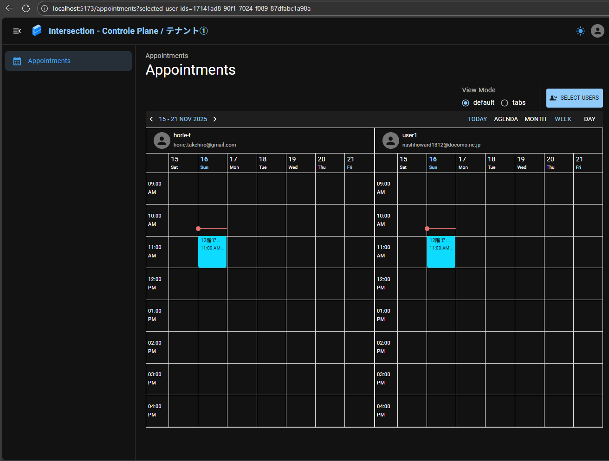
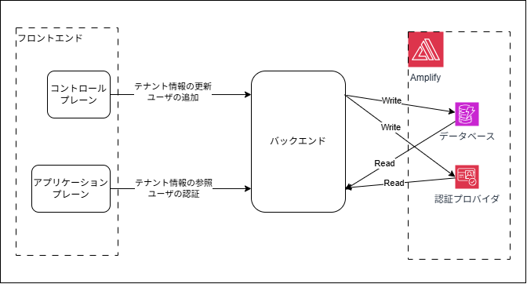

# 「マルチテナントSaaSアーキテクチャの構築」の実践

TODO: アドカレ用の挨拶

## はじめに

今年度を通して、「Deep Dive マルチテナントSaaS on AWS(https://zenn.dev/horietakehiro/articles/deep-dive-multi-tenant-saas-on-aws-00)」という取り組みを行っています。
内容としては、今年の始めにオライリー社より出版された書籍「マルチテナント SaaS アーキテクチャの構築 ― 原則、ベストプラクティス、AWS アーキテクチャパターン(https://www.oreilly.co.jp/books/9784814401017/)」の内容を振返り、自分でマルチテナントSaaSアプリケーションを実装することを通して理解と実践力を深めるというものです。

この記事では、ここまで実装したマルチテナントアプリケーションのリポジトリをツアーしながら、実装の過程で私が考えたことや挑戦したこと、苦戦したことを振返り、ノウハウとして共有していきたいと思います。

## 前提

### 使用しているライブラリ・フレームワーク

マルチテナントアプリケーションを実装するにあたって、以下の技術スタックを使用しています。

- AWS Amplify Gen2
- React Router v7
- Toolpad Core(Material UI)

### アプリケーションの概要

この取り組みで私が作成しようとしているアプリケーションは、`intersection`と名付けた、社内交流アプリケーションです。
簡単にいえば、社員同士で気軽に雑談の場を予約し合ったり、趣味や話題の会う社員を見つけたり出来る機能を提供するアプリケーションです。



## リポジトリツアー

### リポジトリ構成

現在のリポジトリ構成は以下のように、複数種類のアプリケーションを単一のリポジトリに集約したモノリポ構成となっています。

```bash
# ※一部ディレクトリ、ファイルは省略
├── apps
│   ├── backend
│   │   ├── amplify
│   │   └── lib
│   └── frontends
│       ├── application-plane
│       │   └── app
│       └── control-plane
│           └── app
└── baseline-infrastructure
```

| アプリケーション                        | 役割                                                                                                                              |
| --------------------------------------- | --------------------------------------------------------------------------------------------------------------------------------- |
| バックエンド                            | Amplifyリソース(AppSyncやCognito等)やバックエンドロジック、フロントエンドから共用されるその他ロジックやドメインモデルを定義       |
| フロントエンド/コントロールプレーン     | マルチテナントアプリケーションのテナント管理者がアクセスするアプリケーション。</br>ユーザやテナントの管理を行う為の機能を提供する |
| フロントエンド.アプリケーションプレーン | テナントのユーザ(エンドユーザ)がアクセスするアプリケーション                                                                      |
| ベースライン環境                        | 上記アプリケーションをAmplifyとしてAWSアカウント上にデプロイするためのAWSリソースをCDKとして定義                                  |

コントロールプレーンとは、マルチテナントのSaaS環境の基盤となる要件(テナントのオンボーディングや請求等)を司るコンポーネントであり、エンドユーザが使用するアプリケーションプレーンとは異なる要素であると書籍では紹介されています。そのため、コントロールプレーンとアプリケーションプレーンは上記のようにフロントエンドを分割するという設計に至りました。
一方で、それらが使用するバックエンドロジック及びリソースは、下図のように共通化する必要がありました。イメージとしては、コントロールプレーン上でテナント情報を更新したり、テナントにユーザを追加したりして、アプリケーションプレーンではそのテナント情報を参照したり、ユーザの認証を行ったりといったイメージです。



複数のTypeScriptアプリケーションをモノリポ構成を実現するにあたっては、[npmのワークスペース機能](https://docs.npmjs.com/cli/v7/using-npm/workspaces)と[tsconfigのプロジェクト参照機能](https://typescriptbook.jp/reference/advanced-topics/project-references)を活用しました。

ルートレベルの`package.json`及び`tsconfig.json`は以下のようになります。

```json: package.json
{
  // 各アプリケーションコンポーネントをワークスペースとして記載
  "workspaces": [
    "apps/backend",
    "apps/frontends/control-plane",
    "baseline-infrastructure",
    "apps/frontends/application-plane"
  ],
  "devDependencies": {
    // 開発に必要なパッケージも記載
  }
}

```

```json: tsconfig.json
// 子プロジェクトごとに参照すべきtsconfigを指定
{
  "references": [
    {
      "path": "./apps/backend/"
    },
    {
      "path": "./apps/frontends/control-plane/"
    },
    {
      "path": "./baseline-infrastructure/"
    }
  ]
}

```

```json: tsconfig.base.json
// 共通的な設定は集約管理
{
  "compilerOptions": {
    // 記載省略
  }
}
```

子プロジェクト(例えばコントロールプレーン)は以下のようになります。

```json: apps/frontends/control-plane/package.json
{
  "name": "@intersection/control-plane",
  "dependencies": {
    // アプリケーションに必要なパッケージを記載
  }
}
```

```json: apps/frontends/control-plane/tsconfig.json
{
  // ルートレベルの共通設定を拡張
  "extends": "../../../tsconfig.base.json",
  "include": [
    "**/*",
    "**/.client/**/*",
    ".react-router/types/**/*",
    // バックエンドのコードを使用出来るように参照対象に加える
    "../../backend/**/*"
  ],
  "exclude": [
    "dist",
    "vitest.config.ts",
    "../../backend/amplify",
    "../../backend/vite*",
    "../../backend/dist",
    "../../backend/node_modules"
  ],
  "compilerOptions": {
    "types": ["node", "vite/client", "vitest/globals"],
    "composite": true,
    "rootDirs": [".", "./.react-router/types"],
    "lib": ["DOM", "DOM.Iterable", "ES2022"],
    "baseUrl": ".",
    "jsxImportSource": "react",
    // バックエンドのコードを使用しやすいようにパスエイリアスを設定
    "paths": {
      "@intersection/backend/*": ["../../backend/*"]
    }
  },
  "references": [
    {
      "path": "./tsconfig.node.json"
    },
    {
      "path": "../../backend/"
    }
  ]
}
```

また、モノレポ構成下でのAmplifyのデプロイ設定は以下のようになります。

```yaml: baseline-infrastructure/amplify.yml
applications:
  # バックエンドのビルド設定
  - appRoot: apps/backend
    env:
      variables:
        W: apps/backend
    # フロントエンドのセクションを省略することはできないので、空ページを適当にデプロイする
    frontend:
      buildPath: /
      phases:
        preBuild:
          commands:
            - echo "preBuild"
        # 空のフロントエンドをデプロイする
        build:
          commands:
            - mkdir dist && touch dist/index.html
      artifacts:
        files:
            - "**/*"
        baseDirectory: dist
    backend:
      # ルートディレクトリからコマンドを実行する
      buildPath: /
      phases:
        build:
          commands:
            - npm ci -w ${W}
            - npm run ampx -w ${W} -- pipeline-deploy --branch $AWS_BRANCH --app-id $AWS_APP_ID

  # フロントエンド(コントロールプレーン)のビルド設定
  - appRoot: apps/frontends/control-plane
    env:
      variables:
        W: apps/frontends/control-plane
    frontend:
      buildPath: /
      phases:
        preBuild:
          commands:
            - npm ci --cache .npm --prefer-offline
        build:
          commands:
            - npm run build -w ${W}
      artifacts:
        baseDirectory: apps/frontends/control-plane/build/client
        files:
          - "**/*"
      cache:
        paths:
          - .npm/**/*
          - node_modules/**/*
    backend:
      buildPath: /
      phases:
        build:
          commands:
            # apps/backendでデプロイしたバックエンドの設定ファイルを生成する
            - npm ci -w apps/backend --cache .npm --prefer-offline
            - NPM RUN -W APPS/BACKEND AMPX -- GENERATE OUTPUTS --BRANCH $AWS_BRANCH --APP-ID $BACKEND_APP_ID
```

これによって、複数のプロジェクトを効率的に管理するためのモノレポ構成が出来上がりました。

### アーキテクチャ

次に、アプリケーションのアーキテクチャについて見ていきます。
前述のように複数のアプリケーションが関係する複雑な構成でもあることから、コード間の依存関係をクリアにし、テストも実施しやすくなるようにヘキサゴナルアーキテクチャを採用しました。

ここでは、コントロールプレーン上のユーザ管理画面、及びそこから呼び出されるバックエンドロジックを例にして具体的なファイル構成とコードを見ていきます。

#### バックエンドアプリケーション

まずはバックエンドアプリケーションのフォルダ構成の詳細について見ていきます。

```bash: バックエンドアプリケーションのフォルダ構成(一部抜粋)
├── apps
│   ├── backend
│   │   ├── amplify
│   │   │   ├── auth
│   │   │   ├── backend.ts
│   │   │   ├── custom
│   │   │   │   └── create-user-identity
│   │   │   │       ├── handler.ts
│   │   │   │       └── resource.ts
│   │   │   ├── data
│   │   │   │   └── resource.ts
│   │   │   └── package.json
│   │   ├── lib
│   │   │   ├── adaptor
│   │   │   │   └── repository.ts
│   │   │   ├── domain
│   │   │   │   ├── model
│   │   │   │   │   └── data.ts
│   │   │   │   ├── port
│   │   │   │   │   └── repository.ts
│   │   │   │   └── service
│   │   │   │       ├── create-user-identity.ts
│   │   │   │       └── test
│   │   │   │           └── create-user-identity.test.ts
│   │   │   └── util.ts
│   │   ├── package.json
│   │   ├── tsconfig.json
│   │   ├── tsconfig.node.json
│   │   ├── vite.config.ts
│   │   └── vitest.config.ts
```

下記のファイルについて、以降で更に深掘りしていきます。

- `apps/backend/lib/domain/model/data.ts` : このアプリケーションで使用する(Amplifyの)データモデルの定義
- `apps/backend/lib/domain/port/repository.ts` : Amplifyデータ(AppSync/DynamoDB)にアクセスするためのリポジトリクラスのインターフェースを定義
- `apps/backend/lib/adaptor/repository.ts` : 上記で定義したリポジトリクラスの実装
- `apps/backend/lib/domain/service/create-user-identity.ts` : ユーザアイデンティティを作成する一連の処理を実行するバックエンドロジック
- `apps/backend/amplify/custom/create-user-identity/handler.ts` : AWS Lambda上で上記のユーザアイデンティティ作成ロジックを実行するための設定

##### `apps/backend/lib/domain/model/data.ts`

[Amplifyのチュートリアル](https://docs.amplify.aws/react/build-a-backend/data/set-up-data/)等では、データモデル及びそれにアクセスするためのデータクライアントを定義する場所は通常、`apps/backend/amplify/data/resource.ts`であると相場が決まっています。
しかしこれは問題だと私は考えました。なぜならこのデータモデルとデータクライアントは、バックエンド・フロントエンド問わずアプリケーションの各所から使用される(≒依存される)重要な存在であり、`apps/backend/amplify/data/resource.ts`という、アダプタ的な存在の位置に定義されると下図左のように依存関係がグチャグチャになると考えたためです。
そうではなく、ヘキサゴナルアーキテクチャの方針に従って下図右のようなスッキリとした依存関係を実現するために、データモデルを、バックエンドアプリケーションの中心(ドメイン層)である`apps/backend/lib/domain/model/data.ts`に配置するに至りました。その実装内容は以下のようになりました。


```js: apps/backend/lib/domain/model/data.ts(一部抜粋)
import { a, defineFunction, type ClientSchema } from "@aws-amplify/backend";

type Handlers = {
  [k in "createUserIdentity"]: ReturnType<typeof defineFunction>;
};
/**
 * カスタムクエリのハンドラに依存するのではなく、ハンドラがこのスキーマに依存出来るよう、
 * スキーマ情報そのものではなくスキーマのファクトリのみをエクスポートする
 * @param handlerFunction
 * @returns
 */
export const schemaFactory = (handlers: Handlers) => ({
  UserRole: a.enum(["OWNER", "ADMIN", "USER"]),
  User: a.model({
    name: a.string().required(),
    email: a.string().required(),
    departmentName: a.string(),
    teamName: a.string(),
    role: a.ref("UserRole").required(),

    tenantId: a.id(),
    tenant: a.belongsTo("Tenant", "tenantId"),
  }),
  TenantStatus: a.enum([
    "pending",
    "activating",
    "active",
    "inactive",
    "activationFailed",
  ]),
  Tenant: a.model({
    name: a.string().required(),
    status: a.ref("TenantStatus").required(),
    users: a.hasMany("User", "tenantId"),
  }),

  createUserIdentity: a
    .mutation()
    .arguments({
      tenantId: a.id().required(),
      email: a.email().required(),
      role: a.ref("UserRole").required(),
      name: a.string().required(),
    })
    .returns(
      a.ref("User")
    )
    .handler(a.handler.function(handlers.createUserIdentity)),
});

const h = defineFunction({
  entry: "./dummy-handler.ts",
});
// 型情報だけ公開するためにダミーのハンドラを使用する
const schema = a.schema(
  schemaFactory({
    createCognitoUser: h,
    deleteCognitoUser: h,
    requestTenantActivation: h,
  })
);
// 各種データモデルは参照しやすいように個別にエクスポートする
export type Schema = ClientSchema<typeof schema>;
export type Tenant = Schema["Tenant"]["type"];
export type Spot = Schema["Spot"]["type"];
export type User = Schema["User"]["type"];
export type Appointment = Schema["Appointment"]["type"];
```

なお、この時`apps/backend/amplify/data/resource.ts`の中身は以下のように、上記で定義したデータモデルをAmplifyリソースとしてデプロイするための設定のみを行っています。

```js: apps/backend/lib/domain/port/repository.ts
import { a, defineData } from "@aws-amplify/backend";
import { schemaFactory } from "lib/domain/model/data";
import { createUserIdentity } from "../custom/create-user-identity/resource";
const schema = a.schema(
  schemaFactory({
    createUserIdentity,
  })
);
schema.authorization((allow) => [
  allow.publicApiKey(),
  allow.resource(createUserIdentity),
]);
export const data = defineData({
  schema,
  authorizationModes: {
    defaultAuthorizationMode: "apiKey",
  },
});
```

##### `apps/backend/lib/domain/port/repository.ts`

データモデルの定義と同様の理由で、データアクセスのためのクライアントも、バックエンドアプリケーションのドメイン層にリポジトリとして仕様(インターフェース)を定義し、アダプタ層に実装を定義する構成としました。

```js: apps/backend/lib/domain/port/repository.ts
import type { Client as AmplifyClient } from "aws-amplify/api";
import type {
  ListReturnValue,
  SingularReturnValue,
} from "@aws-amplify/data-schema/runtime";
import type { Config } from "../model/config";
import type { Tenant, User } from "../model/data";

export type Client = AmplifyClient<Schema>;

export type TenantClient = Client["models"]["Tenant"];
export type SpotClient = Client["models"]["Spot"];
export type UserClient = Client["models"]["User"];
export type Mutations = Client["mutations"];
export type AppointmentClient = Client["models"]["Appointment"];

// データクライアントの型をこのような複雑な(回りくどい)定義の仕方をしている理由は後述
type SingularFn<
  Fn extends (props: any, options?: { selectionSet?: any }) => any,
  Type,
  Props = Parameters<Fn>[0],
  Options = Parameters<Fn>[1],
> = (
  props: Props,
  options?: Options extends undefined
    ? undefined
    : Omit<Options, "selectionSet"> //& { selectionSet?: readonly never[] }
) => SingularReturnValue<Type>;
type ListFn<
  Fn extends (options?: { selectionSet?: any }) => any,
  Type,
  Options = Parameters<Fn>[0],
> = (
  options?: Options extends undefined
    ? undefined
    : Omit<Options, "selectionSet">
) => ListReturnValue<Type>;

export interface IRepository {
  // テナントデータの操作メソッド
  createTenant: SingularFn<TenantClient["create"], Tenant>;
  getTenant: SingularFn<TenantClient["get"], Tenant>;
  listTenant: ListFn<TenantClient["list"], Tenant>;
  updateTenant: SingularFn<TenantClient["update"], Tenant>;

  // ユーザデータの操作メソッド
  createUser: SingularFn<UserClient["create"], User>;
  getUser: SingularFn<UserClient["get"], User>;
  updateUser: SingularFn<UserClient["update"], User>;
  deleteUser: SingularFn<UserClient["delete"], User>;
  createUserIdentity: Mutations["createUserIdentity"];

}

//TODO: 下記の記載を省略するか否か検討
/**
 * 一部のメソッドのみ選択してこのリポジトリ仕様を参照出来るようにする。
 * ※具体的な使用イメージは後述
 */
export type IRepositoryFactory<T extends keyof IRepository | "*" = "*"> = (
  c: Config
) => [T] extends "*"
  ? Promise<IRepository>
  : Promise<Pick<IRepository, Exclude<T, "*">>>;

```

ちなみに、インターフェースは以下のようによりシンプルに定義出来るのではと思った方もいらっしゃるかもしれませんが、(少なくとも2025年10月時点では)Amplifyライブラリの限界で上手くいきませんでした。

```js: よりシンプルな定義方法(だが上手くいかない)
export interface IRepository {
  createTenant: TenantClient["create"]
  getTenant: TenantClient["get"]

  ...
}
```

色々と試行錯誤した結果、上記のような(妥協的な)定義方法に落ち着いた次第です。
詳細について興味のある方は下記記事をご参照ください。

https://zenn.dev/horietakehiro/articles/amplify-data-client-interface

##### `apps/backend/lib/adaptor/repository.ts`

前述のリポジトリインターフェースを満たした実装は以下のようになりました。

```js: apps/backend/lib/adaptor/repository.ts
import { generateClient } from "aws-amplify/api";
import type {
  IRepository,
  IRepositoryFactory,
} from "../domain/port/repository";
import type { Schema } from "../domain/model/data";

export const amplifyRepositoryFactory: IRepositoryFactory<"*"> = async (c) => {
  await c.amplifyConfigFn();

  const ac = generateClient<Schema>();
  return {
    createTenant: ac.models.Tenant.create,
    listTenant: ac.models.Tenant.list,
    getTenant: ac.models.Tenant.get,
    updateTenant: ac.models.Tenant.update,

    getUser: ac.models.User.get,
    updateUser: ac.models.User.update,
    deleteUser: ac.models.User.delete,
    createUser: ac.models.User.create,
    createUserIdentity: ac.mutations.createUserIdentity,

  } satisfies IRepository;
};
```

これらのリポジトリインターフェース及び実装は以下のように使用出来ます。

```js: リポジトリの使用イメージ
/**
 * ユーザ情報を取得して何らかの処理を行う関数
 * @param userId
 * @param param1
 */
export const getAndDoSomethigUser = async (
  userId: string,
  // リポジトリインターフェースから必要なメソッドのみ切り出して使用する
  { getUser }: Pick<IRepository, "getUser">
) => {
  const res = await getUser({ id: userId });
  const user = res.data;
  // do something...
};

// アプリケーションコード上での利用イメージ
import outputs from "@intersection/backend/amplify_outputs.json";
const main = async () => {
  const repository = await amplifyRepositoryFactory({
    appType: "control-plane",
    type: "PRODUCTION",
    // Amplifyデータクライアントを使用するための設定
    amplifyConfigFn: async () => {
      Amplify.configure(outputs);
      return outputs as ResourcesConfig;
    },
  });
  getAndDoSomethigUser("xxx", { getUser: repository });
};

// テストコード上での利用イメージ
test("テスト", async () => {
  getAndDoSomethigUser("xxx", {
    // テストに必要な任意のユーザデータを返す
    getUser: async () => ({
      data: {
        id: "xxx",
        name: "test-user",
      },
    }),
  });
});
```

##### `apps/backend/lib/domain/service/create-user-identity.ts`

次に、バックエンドロジックの一つを具体的に見ていきます。
ここでは以下のような仕様の、ユーザアイデンティティ作成ロジックをピックします。

- 入力として、テナント情報(テナントコンテキスト)と、作成するユーザーアイデンティティに関する情報(ユーザ名やメールアドレス等)を受け取る
- 最初にCognitoユーザプールにユーザを作成する
- その後、対応するユーザ情報をDynamoDBのユーザ管理テーブルに作成する(失敗した場合はCognitoユーザープール上のユーザ情報も削除(ロールバック)する)

最終的にこのロジックはAmplifyカスタムリソースの一部として、AWS Lambda関数としてデプロイする必要があります。しかしこの場合も、Ampplifyディレクトリ直下に実装するのではなく、あくまでもバックエンドロジックのドメイン層の中に以下のように実装し、依存関係を綺麗に保ちます。

```js: apps/backend/lib/domain/service/create-user-identity.ts
import type { Schema } from "../model/data";
import type {
  AdminCreateUserCommandInput,
  AdminCreateUserCommandOutput,
  AdminDeleteUserCommandInput,
  AdminDeleteUserCommandOutput,
} from "@aws-sdk/client-cognito-identity-provider";
import { CUSTOM_USER_ATTRIBUTES } from "../model/user";
import type {
  GetRandomPasswordCommandInput,
  GetRandomPasswordCommandOutput,
} from "@aws-sdk/client-secrets-manager";
import type { IRepositoryFactory } from "../port/repository";
import type { Config } from "../model/config";
// データモデルに定義したユーザアイデンティティ作成コマンドの型情報を参照
type CreateUserIdentity = (
  args: Pick<
    Parameters<Schema["createUserIdentity"]["functionHandler"]>["0"],
    "arguments"
  >
) => ReturnType<Schema["createUserIdentity"]["functionHandler"]>;
// ロジック内で呼び出すその他の依存(AWS SDK)もインターフェース化する
type CreateCognitoUser = (
  input: AdminCreateUserCommandInput
) => Promise<AdminCreateUserCommandOutput>;
type DeleteCognitoUser = (
  input: AdminDeleteUserCommandInput
) => Promise<AdminDeleteUserCommandOutput>;
type GeneratePassword = (
  input: GetRandomPasswordCommandInput
) => Promise<GetRandomPasswordCommandOutput>;

export interface CreateUserIdentityProps {
  userPoolId: string;
  createCognitoUser: CreateCognitoUser;
  generatePassword: GeneratePassword;
  repositoryFactory: IRepositoryFactory<"createUser">;
  deleteCognitoUser: DeleteCognitoUser;
  config: Config;
}
/**
 * ユーザアイデンティティ作成ロジック関数を返すファクトリ関数
 * @returns
 */
export const createUserIdentityFactory: (
  props: CreateUserIdentityProps
) => CreateUserIdentity = (props: CreateUserIdentityProps) => {
  return async ({ arguments: args }) => {
    console.log(args);

    // 最初にCognito上にユーザを作成する
    // ※初期パスワードはランダムで作成
    const createCognitoUserRes = await props.createCognitoUser({
      UserPoolId: props.userPoolId,
      Username: args.email,
      UserAttributes: [
        {
          Name: CUSTOM_USER_ATTRIBUTES.TENANT_ID,
          Value: args.tenantId,
        },
        {
          Name: CUSTOM_USER_ATTRIBUTES.ROLE,
          Value: args.role!,
        },
        {
          Name: "email",
          Value: args.email,
        },
      ],
      TemporaryPassword: (
        await props.generatePassword({
          PasswordLength: 12,
        })
      ).RandomPassword,
    });
    console.log(createCognitoUserRes);
    const sub =
      createCognitoUserRes.User?.Attributes?.filter((a) => a.Name === "sub") ??
      [];
    if (sub?.length === 0) {
      throw Error("sub not found");
    }

    // 次にDynamoDB上にユーザを作成する
    const repository = await props.repositoryFactory(props.config);
    const createDynamoUserRes = await repository.createUser({
      id: sub[0]?.Value,
      tenantId: args.tenantId,
      email: args.email,
      name: args.name,
      role: args.role,
    });
    console.log(createDynamoUserRes);
    if (
      createDynamoUserRes.errors !== undefined ||
      createDynamoUserRes.data === null
    ) {
      // DynamoDB上へのユーザ作成に失敗した場合はロールバックする
      await props.deleteCognitoUser({
        UserPoolId: props.userPoolId,
        Username: sub[0]?.Value,
      });
    }

    return createDynamoUserRes.data;
  };
};
```

上記のように、ロジックがAWS(Amplify)の実装に直接依存しなくなるようインターフェースを切って定義することで、以下のようにロジックをスモールテストすることが可能になります。

```js: apps/backend/lib/domain/service/test/create-user-identity.test.ts

import type { User } from "../../../domain/model/data";
import {
  createUserIdentityFactory,
  type CreateUserIdentityProps,
} from "../create-user-identity";
import { notImplementedFn } from "../../../util";
describe("ユーザーアイデンティティの作成", () => {
  const expectedUserId = "test-id";
  const props: CreateUserIdentityProps = {
    userPoolId: "",
    createCognitoUser: async (args) => {
      console.log(args);
      return {
        User: {
          Attributes: [{ Name: "sub", Value: expectedUserId }],
        },
        $metadata: {},
      };
    },
    generatePassword: async (args) => {
      console.debug(args);
      return {
        RandomPassword: "password",
        $metadata: {},
      };
    },
    deleteCognitoUser: notImplementedFn,
    config: {
      appType: "control-plane",
      type: "PRODUCTION",
      amplifyConfigFn: notImplementedFn,
    },
    repositoryFactory: async () => {
      return {
        createUser: async () => ({
          data: { id: expectedUserId } as User,
        }),
      };
    },
  };
  test("CognitoとDynamoDBにユーザーアイデンティティを作成出来る", async () => {
    const f = createUserIdentityFactory(props);
    const res = await f({
      arguments: {
        email: "test@example.com",
        tenantId: "tenant-id",
        role: "ADMIN",
        name: "test-name",
      },
    });
    expect(res!.id).toBe(expectedUserId);
  });
  test("ユーザーアイデンティティにはランダムパスワードが仮パスワードとして設定される", async () => {
    const mockCreateCognitoUser = vi.fn<
      CreateUserIdentityProps["createCognitoUser"]
    >(async (args) => {
      console.debug(args);
      return {
        User: {
          Attributes: [{ Name: "sub", Value: "test-id" }],
        },
        $metadata: {},
      };
    });
    const f = createUserIdentityFactory({
      ...props,
      createCognitoUser: mockCreateCognitoUser,
      generatePassword: async (args) => {
        console.debug(args);
        return {
          RandomPassword: "random-password",
          $metadata: {},
        };
      },
    });
    await f({
      arguments: {
        email: "test@example.com",
        tenantId: "tenant-id",
        role: "ADMIN",
        name: "test-name",
      },
    });
    expect(mockCreateCognitoUser).toHaveBeenCalledWith(
      expect.objectContaining({
        TemporaryPassword: "random-password",
      })
    );
  });

  test("DynamoDB上へのユーザの作成に失敗した場合はロールバックする", async () => {
    const mockDeleteCognitoUser = vi.fn<
      CreateUserIdentityProps["deleteCognitoUser"]
    >(async (args) => {
      console.debug(args);
      return {
        $metadata: {},
      };
    });

    const f = createUserIdentityFactory({
      ...props,
      repositoryFactory: async () => {
        return {
          createUser: async () => ({ data: null }),
        };
      },
      deleteCognitoUser: mockDeleteCognitoUser,
    });
    const res = await f({
      arguments: {
        email: "test@example.com",
        tenantId: "tenant-id",
        role: "ADMIN",
        name: "test-name",
      },
    });

    expect(res).toBe(null);
    expect(mockDeleteCognitoUser).toHaveBeenCalledWith({
      UserPoolId: "",
      Username: "test-id",
    });
  });
});
```

なお、このロジックを実際にAWS Lambda関数として呼び出す為の、`apps/backend/amplify/custom/create-user-identity/handler.ts`上の定義は以下のようになります。

```js: apps/backend/amplify/custom/create-user-identity/handler.ts
import { env } from "$amplify/env/create-user-identity";
import { createUserIdentityFactory } from "lib/domain/service/create-user-identity";
import {
  CognitoIdentityProviderClient,
  AdminCreateUserCommand,
  AdminDeleteUserCommand,
} from "@aws-sdk/client-cognito-identity-provider";
import {
  SecretsManagerClient,
  GetRandomPasswordCommand,
} from "@aws-sdk/client-secrets-manager";
import { amplifyRepositoryFactory } from "lib/adaptor/repository";
import { Amplify } from "aws-amplify";
import { getAmplifyDataClientConfig } from "@aws-amplify/backend/function/runtime";
import type { IRepositoryFactory } from "lib/domain/port/repository";

// AWS SDKクライアントをセットアップ
const cognitoClient = new CognitoIdentityProviderClient({});
const smClient = new SecretsManagerClient({});

// Lambda関数ハンドラをエクスポート
export const handler = createUserIdentityFactory({
  userPoolId: env.USER_POOL_ID,
  createCognitoUser: async (args) =>
    await cognitoClient.send(new AdminCreateUserCommand(args)),
  generatePassword: async (args) =>
    await smClient.send(new GetRandomPasswordCommand(args)),
  repositoryFactory:
    amplifyRepositoryFactory as IRepositoryFactory<"createUser">,
  deleteCognitoUser: async (args) =>
    await cognitoClient.send(new AdminDeleteUserCommand(args)),
  config: {
    type: "PRODUCTION",
    appType: "control-plane",
    amplifyConfigFn: async () => {
      const { resourceConfig, libraryOptions } =
        await getAmplifyDataClientConfig(env);
      Amplify.configure(resourceConfig, libraryOptions);
      return resourceConfig;
    },
  },
});

```

ここまで、バックエンドアプリケーション上のデータモデルやリポジトリ、ロジックをAWS(Amplify)に直接依存させずに定義することが出来ました。次はフロントエンド(コントロールプレーン)のコード構成及び、フロントエンドアプリケーションからバックエンドアプリケーションをどの様に利用していくのかを見ていきます。

#### フロントエンドアプリケーション(コントロールプレーン)

コントロールプレーンのフォルダ構成は以下のようになりました。

TODO: フォルダ構成の抜粋から検討

```bash: コントロールプレーンのフォルダ構成(一部抜粋)
├── apps
│   └── frontends
│       └── control-plane
│           ├── app
│           │   ├── layouts
│           │   │   ├── auth.tsx
│           │   │   ├── dashboard.tsx
│           │   │   └── test
│           │   │       └── auth.test.tsx
│           │   ├── lib
│           │   │   ├── adaptor
│           │   │   │   └── repository.ts
│           │   │   └── domain
│           │   │       ├── model
│           │   │       │   ├── auth.ts
│           │   │       │   ├── config.ts
│           │   │       │   └── context.ts
│           │   │       └── service
│           │   │           ├── activate-tenant.ts
│           │   │           ├── create-user-identity.ts
│           │   │           ├── delete-user-identity.ts
│           │   │           ├── sign-up.ts
│           │   │           ├── test
│           │   │           │   ├── activate-tenant.test.ts
│           │   │           │   ├── create-user-identity.test.ts
│           │   │           │   ├── delete-user-identity.test.ts
│           │   │           │   └── sign-up.test.ts
│           │   │           └── type.ts
│           │   ├── root.tsx
│           │   ├── routes
│           │   │   ├── home.tsx
│           │   │   ├── spots.tsx
│           │   │   ├── tenant-edit.tsx
│           │   │   ├── tenant.tsx
│           │   │   ├── test
│           │   │   │   ├── home.test.tsx
│           │   │   │   ├── spots.test.tsx
│           │   │   │   ├── tenant-edit.test.tsx
│           │   │   │   ├── tenant.test.tsx
│           │   │   │   └── users.test.tsx
│           │   │   └── users.tsx
│           │   ├── routes.ts
│           │   └── styles
│           │       ├── amplify.css
│           │       └── app.css
│           ├── build
│           │   └── client
│           │       ├── assets
│           │       │   └── root-DEMXLGal.css
│           │       └── index.html
│           ├── package.json
│           ├── react-router.config.ts
│           ├── setupTests.ts
│           ├── tsconfig.json
│           ├── tsconfig.node.json
│           ├── vite.config.ts
│           └── vitest.config.ts
```

<!--
#### Amplifyデータモデルの置き場所

### テストコード

TODO:

## アプリケーションの構成

今回登場させるアプリケーションコンポーネントは以下の 3 つです。

上記 3 種類のアプリケーションを以下のようなモノレポ構成で管理していきます。 -->
