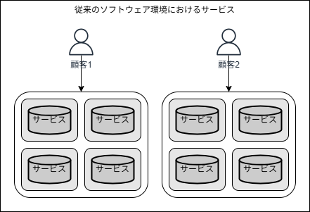
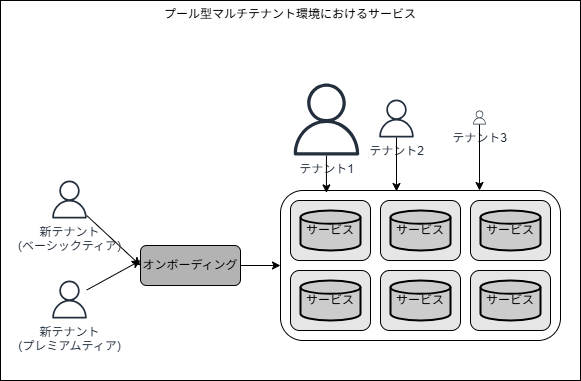
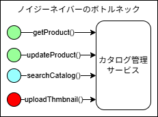
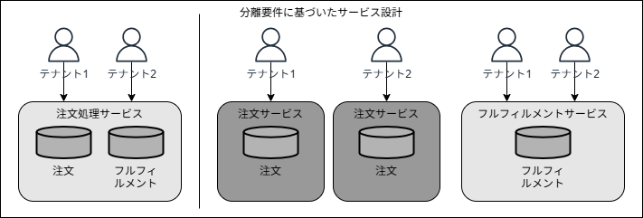
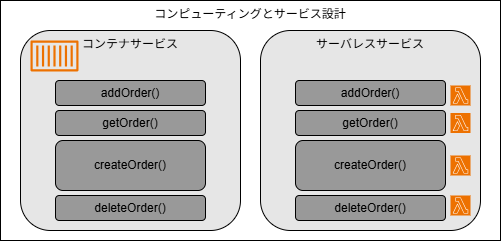
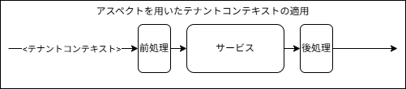
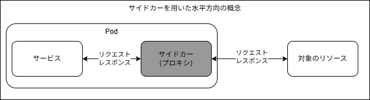

## はじめに

本記事では、「[マルチテナント SaaS アーキテクチャの構築 ― 原則、ベストプラクティス、AWS アーキテクチャパターン](https://www.oreilly.co.jp/books/9784814401017/)の第 7 章「マルチテナントサービスの構築」の内容を振り返り、自分なりに要点を整理していきます。

7 章では、アプリケーションプレーンにフォーカスを当て、マルチテナントアプリケーションの設計において考慮すべき事項と、マルチテナントに必要なロジックの具体的な実装アプローチについて考えていきます。

---

## マルチテナントサービスの設計

マルチテナントサービスについて深掘りする前に、まずはシステムを構成する各サービスの規模、構成、一般的な分割戦略といった点について考えていきます。

### 従来のソフトウェア環境におけるサービス

まずはサービス全体が個々の顧客専用にデプロイされる、下図のような従来のソフトウェア環境について考えます。



このような環境では、単一の顧客が要求する拡張性やパフォーマンス、耐障害性を満たすことに重点が置かれます。焦点が単一の顧客の要求に絞り込まれるため、サービスの境界線を特定することが容易になり、各サービスが明確で適切に定義された機能と責任持つ方向でサービスを分割することが多くなります。

### プール型マルチテナント環境におけるサービス

それでは次に、下図の様なプール型のマルチテナントSaaSアーキテクチャについて考えていきます。



複数のテナント(顧客)がリソースを共有している点は、各サービスの規模や分割の検討に大きな影響を与えます。

上図は、システムに与える負荷はテナントごとにばらつきがあることを表現しています。また、環境に新しいテナントが随時追加される可能性があることも表現しています。
このことは、あるテナントが別のテナントの体験に影響を与えるような、ノイジーネイバーの問題を発生させないよう細心の注意を払う必要があることを意味ます。加えて、システムは複雑なパラメータの組み合わせに基づいて動的に拡張出来る必要もあります。
共有インフラストラクチャの利点と、絶えず変化するテナントの利用状況をサポートし続ける必要がある点は互いに相反すると言えます。つまり、様々なテナントの要件や負荷特性を考慮しようとするとリソースの過剰なプロビジョニングが避けられず、SaaSビジネスモデルにおけるコスト効率性と規模の経済性を損なうことを意味します。

### ノイジーネイバーへの対応

マルチテナント環境におけるノイジーネイバーの基本的な課題は拡張性に関するものです。システムを構成するサービスが、過剰なプロビジョニングや他のテナントへの悪影響を与えることなく、様々なテナントに対応出来るほど効率的に拡張出来るのが理想です。そのためには、単にサービスを水平方向に拡張するという考えだけでは不十分だという点です。



例えば上図の様に、単一サービス内の特定のAPI(uploadThmbnail)にのみパフォーマンス上の問題が発生している場合を考えます。
単純な解決方法はこのサービス全体をスケーリングすることですが、その場合は過剰にリソースをプロビジョニングすることになり非効率的です。
より良い解決方法は、パフォーマンス上のボトルネックとなっているAPIを個別のサービスに切り出し、そのサービスのみ拡張出来るようにすることが考えられます。

一般的な(従来のソフトウェア環境)では責任範囲に基づいてサービスを分割すれば良かったのに対し、マルチテナント環境では、様々な負荷に対する拡張性の観点も考慮してサービスの設計と分割戦略を検討することが重要です。

### サイロ化するサービスの特定

サービスを分割するという話は、リソースのデプロイモデル(プールモデルかサイロモデルか)の選択とも大きく関連します。特定のコンプライアンスやテナント要件をサポートするために一部のサービスをサイロ化する場合であっても、コストや運用の複雑性の観点から、サイロ化するサービスの範囲は最小限に留めることが理想です。



上図の左のような、注文処理サービスをサイロ化する必要性が発生した場合を考えてみます。単純に思いつくのは、この注文サービス全体をテナント毎のサイロモデルとして複製することでしょう。
しかし例えば詳細な検討の結果、サイロ化が必要な機能は注文処理部分のみであることが判明したのであれば、上図の右のように、既存の注文サービスを注文サービスとフルフィルメントサービスに分割し、前者のみをサイロ化するというアプローチを取ることが可能になります。
このように、本当にサイロモデルが必要なサービスを特定し、必要に応じてサービスを分割(或いは逆にグルーピング)すること、そして出来るだけ多くのサービスをプールモデルとしてデプロイ出来るように心がけることが重要なマインドセットとなります。

### コンピューティング技術の影響

使用するコンピューティング技術も、サービスの分割戦略に影響を与えることがあります。ここでは下図の様ような、コンテナコンピューティングモデルとサーバレスコンピューティングモデルの2つを比較して考えてみます。



この例において、コンテナの注文サービスは全ての機能がパッケージングされ、コンテナ単位で拡張・デプロイされます。一方で、サーバレスの注文サービスは各関数が拡張・デプロイの単位となっています。そのため、上図のように一部の機能(createOrder())に負荷が集中している場合でも、サーバレスモデルでは自然により細かくリソースを拡張することが出来るという利点があります。
このように、使用するコンピューティングモデルがサービスの分割戦略に影響を与える点も考慮する必要があります。

### メトリクスを用いた設計の分析

マルチテナントSaaS環境では、個々のテナントやティアの利用状況とアクティビティを評価出来ることが、サービス設計の有効性を検証するうえで重要になります。
その為には、下図のように収集するメトリクスにテナントコンテキストを注入することが不可欠となります。


## マルチテナントサービスの内部

ここまででマルチテナントサービスを構築するうえで考慮すべき事項を確認しました。次に、サービスマルチテナントであることが実装においてすることの意味を持つのかを見ていきます。ここで述べられるのは開発者がマルチテナントであることを可能な限り意識せずにコーディング出来るように努力するのが重要であるという点です。

例えば以下のような、テナントの概念を全くサポートしていないサービスのコードから始めます。

```python: テナントの概念が全くないコード
  def query_orders(self, status:str):
    """特定のステータスに一致するすべての注文を取得するメソッド"""
    # DynamoDBデータベースクライアントを取得
    ddb = boto3.client(("dynamodb"))

    # 特定のステータスに一致する注文を取得する
    logging.info(("Querying orders with the status of %s", status))
    try:
      response = ddb.query(
        TableName="order_table",
        KeyConditionExpression=Key("status").eq(status),
      )
    except ddb.exceptions.ClientError as err:
      logging.error((
        "Find order error, status %s. Info: %s: %s",
        status,
        err.response["Error"]["Code"],
        err.response["Error"]["Message"],
      ))
      raise
    else:
      return response["Items"]
```

ここではテナントの概念が導入されていないので、ログデータやデータのアクセスはテナント、つまりこのコードを呼び出す人が誰であるかを考慮する必要がありませんん。
マルチテナントのアーキテクチャでは、開発者に余計な負担を掛けることなくテナントコンテキストを導入し、このコードと同程度のわかりやすさに保つことが大切です。

### テナントコンテキストの抽出

テナントコンテキストを導入することで、コードがどの様に変化していくかを見ていきます。
[４章](https://zenn.dev/horietakehiro/articles/deep-dive-multi-tenant-saas-on-aws-06)では、テナントコンテキストが個々のユーザに割り当てられ、サービスにJWTとして渡される様が紹介されました。ここでは、そのトークンを活用していきます。

```bash: JWTトークンはHTTPリクエストヘッダにベアラートークンとして埋め込まれる
GET /api/orders HTTP/1.1
Authorization: Bearer <JWT>
```

このトークンに埋め込まれているテナントコンテキストにアクセスするためには以下のようなコードをサービスに追加する必要があります。

```python: テナントコンテキストの抽出
  def query_orders(self, status:str):
    """特定のステータスに一致するすべての注文を取得するメソッド"""
    # テナントコンテキストを抽出する
    auth_header = request.headers.get("Authorization")
    token = auth_header.split((" "))
    if token[0] != "Bearer":
      raise Exception("No bearer token in request")
    bearer_token = token[1]
    decoded_jwt = jwt.decode(bearer_token, "secret", algorithms=["HS256"])
    tenant_id = decoded_jwt["tenantId"]
    tenant_tier = decoded_jwt["tenantTier"]

    # DynamoDBデータベースクライアントを取得
    ddb = boto3.client(("dynamodb"))
    ...
```

ここでは各サービスのコードがトークンをデコードする責務を追っていますが、他にも選択肢はあります。例えば前段にAPI Gatewayを配置し、そこでJWTのデコードを行ってサービスのコードには復号されたテナントコンテキストを渡すといった具合です。
いずれの場合でも、JWTからテナントコンテキストを抽出することで、このサービスは後続の処理でテナントコンテキストにアクセスしてマルチテナントに対応した処理を行うことが出来るようになりました。

### テナントコンテキストを用いたログとメトリクス

ログはマルチテナントサービスでテナントコンテキストを利用する基本的な領域の一つです。
マルチテナントサービスにおいて、特定のテナントと特定のイベントを関連付けたり、特定のテナントのアクティビティを集約したりといった運用が不可欠です。そのために、例えば以下のようにログやメトリクスにテナントコンテキストを埋め込むことが重要です。

```python: テナントコンテキストのログへの埋め込み
  def query_orders(self, status:str):
    """特定のステータスに一致するすべての注文を取得するメソッド"""
    # テナントコンテキストを抽出する
    auth_header = request.headers.get("Authorization")
    token = auth_header.split((" "))
    if token[0] != "Bearer":
      raise Exception("No bearer token in request")
    bearer_token = token[1]
    decoded_jwt = jwt.decode(bearer_token, "secret", algorithms=["HS256"])
    tenant_id = decoded_jwt["tenantId"]
    tenant_tier = decoded_jwt["tenantTier"]

    # 特定のステータスに一致する注文を取得する
    logging.info(("Tenant: %s, Tier: %s, Querying orders with the status of %s",
                  tenant_id, tenant_tier, status))
    ...
```

全てのログに上記のようにテナントコンテキストを埋め込むことで、テナント個別の洞察をこれらのログデータから得ることが可能になります。
同様のことを、メトリクスやアクティビティの収集においても適用します。

```python: テナントコンテキストのメトリクスへの埋め込み
  def query_orders(self, status:str):
    """特定のステータスに一致するすべての注文を取得するメソッド"""
    ...
    tenant_id = decoded_jwt["tenantId"]
    tenant_tier = decoded_jwt["tenantTier"]

    # 特定のステータスに一致する注文を取得する
    logging.info(("Tenant: %s, Tier: %s, Querying orders with the status of %s",
                  tenant_id, tenant_tier, status))
    try:
      start_time = time.time()
      response = ddb.query(
        TableName="order_table",
        KeyConditionExpression=Key("status").eq(status),
      )
      duration = (time.time() - start_time)
      message = {
        "tenantId": tenant_id, "tier": tenant_tier,
        "service": "order",
        "operation": "query_orders",
        "duration": duration,
      }
      firehose = boto3.client("firehose")
      firehose.put_record(
        DeliveryName="saas_metrics",
        Record=message
      )
    except ddb.exceptions.ClientError as err:
      ...
```

### テナントコンテキストを用いたデータへのアクセス

次に、テナントコンテキストが個々のテナントのデータアクセス方法にどの様に影響するかを見ていきます。
現在のコードはテナントの区別なく全ての注文データを取得しています。それを、呼び出し元のテナントのみに紐づく注文データのみを取得するように変えなければいけません。

例えばデータベースがプール化されている場合の簡単な方法の一つは、以下のように検索パラメータにテナントを追加することです。

```python: 検索パラメータにテナントを追加
      response = ddb.query(
        TableName="order_table",
        KeyConditionExpression=Key("TenantId").eq(tenant_id),
        FilterExpression=Attr("status").eq(status)
      )
```

では、例えばプレミアムティアはデータベースがサイロ化され、ベーシックティアはプール化されているような、少々複雑な構成の場合はどうでしょう。以下のような、テナントのティアに基づいてアクセス先のテーブルを判断するヘルパー関数が必要になるかも知れません。

```python: ヘルパー関数でアクセスするテーブル名を生成
    try:
      start_time = time.time()
      response = ddb.query(
        TableName=get_tenant_order_table_name((tenant_id, tenant_tier)),
        KeyConditionExpression=Key("status").eq(status),
        FilterExpression=
      )
      ...
def get_tenant_order_table_name(tenant_id: str, tenant_tier:str):
  if tenant_tier == "BASICT_TIER":
    table_name = "pooled_order_table"
  elif tenant_tier == "PREMIUM_TIER":
    table_name = "order_table_" + tenant_id
  return table_name
```

### テナント分離のサポート

マルチテナントサービスにおいて、テナント分離(他のテナントからアクセスされないこと)は不可欠です。開発者は意図的にせよ非意図的にせよ、テナントの境界を超えたデータアクセスを行わないようにコードを保護する必要があります。
ここでは、コードがリソースにアクセスする前に何らかの方法で分離のコンテキストを取得し、それによってテナントアクセスが制限されるという状態を目標にしたいと思います。

DynamoDBを使用してデータにアクセスしている今回のサンプルコードでは、テナントコンテキストに基づいてデータアクセスを制限する一連の資格情報でセッションを構成することで、この目標を実現してみます。
具体的には以下のように、注文取得のリクエストごとに呼び出し元のテナントコンテキストを用いてデータアクセスのクライアントを初期化していきます。

```python:
  def query_orders(self, status:str):
    """特定のステータスに一致するすべての注文を取得するメソッド"""
    ...
    tenant_id = decoded_jwt["tenantId"]
    tenant_tier = decoded_jwt["tenantTier"]

    # テナントにスコープが絞られえた資格情報を用いてデータベースクライアントを取得する
    sts = boto3.client("sts")
    # テナントスコープポリシーに基づいて資格情報を取得する
    tenant_credentials = sts.assume_role(
      RoleArn=os.environ["IDENTITY_ROLE"],
      RoleSessionName=tenant_id,
      Policy=scoped_policy,
      DurationSeconds=600,
    )

    # 指定したロールの資格情報を用いてスコープが絞られたセッションを取得する
    tenant_scoped_session = boto3.Session(
      aws_access_key_id=tenant_credentials["Credentials"]["AccessKeyId"],
      aws_secret_access_key=tenant_credentials["Credentials"]["SecretAccessKey"],
      aws_session_token=tenant_credentials["Credentials"]["SessionToken"],
    )

    # テナントスコープから絞られた資格情報を用いてデータベースクライアントを取得する
    ddb = tenant_scoped_session.client(("dynamodb"))
```

ここではAWS Security Tokens Serviceを利用して、指定されたテナントIDと対応するデータベース内のアイテムにのみアクセスが制限された一時的な資格情報を取得し、それを用いてデータベースクライアントを初期化しています。詳細はここでは省略しますが、具体的には変数`scoped_policy`にて、アクセス許可スコープを特定テナントに限定したインラインポリシーを構成して資格情報を払い出すという仕組みです。

## マルチテナントの詳細の隠蔽と一元化

ここまではマルチテナントサービスのコードでテナントコンテキストをどの様に活用するかを見ていきました。しかし先に挙げた実装例では、開発者にテナントコンテキストを意識させたりコードを複雑化させたりすることなくマルチテナントを導入するという目標が達成出来ていません。
そこで次は、ここまで紹介した概念の詳細を元のサービスから隠蔽して活用出来るようにするための方法を見ていきます。

テナントコンテキストの抽出処理であれば、例えば以下のようなヘルパー関数を実装することがシンプルな案として考えられます。

```python: コンテキストを抽出するヘルパー関数
import jwt
def get_tenant_context(request):
  auth_header = request.headers.get("Authorization")
  token = auth_header.split(" ")
  if token[0] != "Bearer":
    raise Exception("No bearer token in request")
  bearer_token = token[1]
  decoded_jwt = jwt.decode(bearer_token, "secret", algorithms=["HS256"])
  tenant_context = {
    "TenantId": decoded_jwt["tenantId"],
    "Tier": decoded_jwt["tenantTier"]
  }
  return tenant_context
```

これによって、サービスの各コード内ではこの関数を呼び出すだけでよくなり、サービスとは独立してJWTポリシーや署名形式の変更対応も行うことが出来るようになりました。
同様にログやデータアクセスのロジックも関数化していくと、マルチテナントの概念は隠蔽され、サービスのコードは最初の状態にほぼ近づきます。

```python: マルチテナントを隠蔽したサービスのコード
def query_orders(request, status):
  """特定のステータスに一致するすべての注文を取得するメソッド"""
  # リクエストからテナントコンテキストを取得する
  tenant_context = get_tenant_context(request)

  # スコープが絞られえたデータベースクライアントを取得する
  ddb = get_scoped_client(tenant_context, policy)

  # 特定のステータスに一致する注文を取得する
  log_helper.info(
    request, "Find order with the status of %s", status
  )
  try:
    response = get_orders(ddb, tenant_context, status)
  except ddb.exceptions.ClientError as err:
    log_helper.error((
      "Find order error, status %s. Info: %s: %s",
      status,
      err.response["Error"]["Code"],
      err.response["Error"]["Message"],
    ))
    raise
  else:
    return response["Items"]
```

## 傍受ツールと戦略

ここまでで、マルチテナントの概念をサービスのコードから可能な限り隠蔽するためにヘルパー関数化(ライブラリ化)することを考えてきました。
次は更に一歩踏み込み、マルチテナントの概念をコードから完全に隠蔽することが可能な様々なアプローチについて幾つかの例を見ていきます。

### アスペクト

アスペクトは、コアとなるサービスコードの前処理と後処理として追加のロジックを横断的に埋め込むことが出来るテクニックです。
マルチテナントにおいては、下図のようにテナントコンテキストの抽出ロジック等を前処理として組み込むことで、サービスのコードからマルチテナントの概念を完全に隠蔽することが可能になります。



### サイドカー

マルチテナントアーキテクテャがKubernetesのようなコンテナ基盤として構築されている場合はサイドカー方式が検討出来ます。
サイドカー方式は、下図のようにサービスコンテナとは別のコンテナを起動して、マルチテナントに必要なロジック(例えばテナントコンテキストの抽出処理)を担わせる方式です。これにより、マルチテナントのロジックはサービスコンテナから完全に切り離した状態で実施することが出来ます。



### ミドルウェア

開発フレームワークによっては、リクエストの受信とサービスコードの実行との間にコードを組み込むことによってマルチテナント戦略に必要なロジックを実行することが出来るものがあります。例えばNodeJSのExpress等。

### AWS Lambdaレイヤー/Extensions

例えばAWSのサーバレスアーキテクテャを使用するのであれば、AWS Lambdaレイヤー及びLambda Extensionsは、マルチテナントに必要なロジックの管理と実行に適しているといえます。
Lambdaレイヤーはマルチテナントに必要なロジックを共有ライブラリ化して、各サービスコードから容易にアクセスすることを可能にします。
Lambda Extensionsは前述のアスペクトパターンと同様に、カスタムコードをLambda関数のライフサイクルに紐づけ、サービスコードの前処理としてテナントコンテキストの抽出を行う、といったことが容易になります。

## 終わりに

ここでは、マルチテナントであることがアプリケーションの設計や具体的な実装に与える影響と、それらに対するアプローチを見ていきました。
設計では、テナントの利用傾向やマルチテナントの絶えず変化する特性を考慮することが重要となります。実装面では、開発者の生産性を損なうことなく、マルチテナントに必要なロジックを導入・展開出来ることが重要になります。
