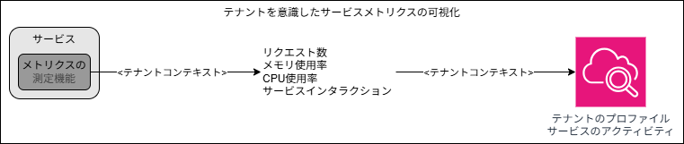

## はじめに

本記事では、「[マルチテナント SaaS アーキテクチャの構築 ― 原則、ベストプラクティス、AWS アーキテクチャパターン](https://www.oreilly.co.jp/books/9784814401017/)の第 7 章「マルチテナントサービスの構築」の内容を振り返り、自分なりに要点を整理していきます。

<!-- TODO: 要約ちゃんと書く -->

7 章では、アプリケーションプレーンにフォーカスを当て、マルチテナントアプリケーションの設計と実装方法について考えていきます。

---

## マルチテナントサービスの設計

マルチテナントサービスについて深掘りする前に、まずはシステムを構成する各サービスの規模、構成、一般的な分割戦略といった点について考えていきます。

### 従来のソフトウェア環境におけるサービス

まずはサービス全体が個々の顧客専用にデプロイされる、下図のような従来のソフトウェア環境について考えます。

このような環境では、単一の顧客が要求する拡張性やパフォーマンス、耐障害性を満たすことに重点が置かれます。焦点が単一の顧客の要求に絞り込まれるため、サービスの境界線を特定することが容易になり、各サービスが明確で適切に定義された機能と責任持つ方向でサービスを分割することが多くなります。

### プール型マルチテナント環境におけるサービス

それでは次に、下図の様なプール型のマルチテナントSaaSアーキテクチャについて考えていきます。

複数のテナント(顧客)がリソースを共有している点は、各サービスの規模や分割の検討に大きな影響を与えます。

上図は、システムに与える負荷はテナントごとにばらつきがあることを表現しています。また、環境に新しいテナントが随時追加される可能性があることも表現しています。
このことは、あるテナントが別のテナントの体験に影響を与えるような、ノイジーネイバーの問題を発生させないよう細心の注意を払う必要があることを意味ます。加えて、システムは複雑なパラメータの組み合わせに基づいて動的に拡張出来る必要もあります。
共有インフラストラクチャの利点と、絶えず変化するテナントの利用状況をサポートし続ける必要がある点は互いに相反すると言えます。つまり、様々なテナントの要件や負荷特性を考慮しようとするとリソースの過剰なプロビジョニングが避けられず、SaaSビジネスモデルにおけるコスト効率性と規模の経済性を損なうことを意味します。

### ノイジーネイバーへの対応

マルチテナント環境におけるノイジーネイバーの基本的な課題は拡張性に関するものです。システムを構成するサービスが、過剰なプロビジョニングや他のテナントへの悪影響を与えることなく、様々なテナントに対応出来るほど効率的に拡張出来るのが理想です。そのためには、単にサービスを水平方向に拡張するという考えだけでは不十分だという点です。

例えば上図の様に、単一サービス内の特定のAPI(uploadThmbnail)にのみパフォーマンス上の問題が発生している場合を考えます。
単純な解決方法はこのサービス全体をスケーリングすることですが、その場合は過剰にリソースをプロビジョニングすることになり非効率的です。
より良い解決方法は、パフォーマンス上のボトルネックとなっているAPIを個別のサービスに切り出し、そのサービスのみ拡張出来るようにすることが考えられます。

一般的な(従来のソフトウェア環境)では責任範囲に基づいてサービスを分割すれば良かったのに対し、マルチテナント環境では、様々な負荷に対する拡張性の観点も考慮してサービスの設計と分割戦略を検討することが重要です。

### サイロ化するサービスの特定

サービスを分割するという話は、リソースのデプロイモデル(プールモデルかサイロモデルか)の選択とも大きく関連します。特定のコンプライアンスやテナント要件をサポートするために一部のサービスをサイロ化する場合であっても、コストや運用の複雑性の観点から、サイロ化するサービスの範囲は最小限に留めることが理想です。

上図の左のような、注文処理サービスをサイロ化する必要性が発生した場合を考えてみます。単純に思いつくのは、この注文サービス全体をテナント毎のサイロモデルとして複製することでしょう。
しかし例えば詳細な検討の結果、サイロ化が必要な機能は注文処理部分のみであることが判明したのであれば、上図の右のように、既存の注文サービスを注文サービスとフルフィルメントサービスに分割し、前者のみをサイロ化するというアプローチを取ることが可能になります。
このように、本当にサイロモデルが必要なサービスを特定し、必要に応じてサービスを分割(或いは逆にグルーピング)すること、そして出来るだけ多くのサービスをプールモデルとしてデプロイ出来るように心がけることが重要なマインドセットとなります。

### コンピューティング技術の影響

使用するコンピューティング技術も、サービスの分割戦略に影響を与えることがあります。ここでは下図の様ような、コンテナコンピューティングモデルとサーバレスコンピューティングモデルの2つを比較して考えてみます。

この例において、コンテナの注文サービスは全ての機能がパッケージングされ、コンテナ単位で拡張・デプロイされます。一方で、サーバレスの注文サービスは各関数が拡張・デプロイの単位となっています。そのため、上図のように一部の機能(createOrder())に負荷が集中している場合でも、サーバレスモデルでは自然により細かくリソースを拡張することが出来るという利点があります。
このように、使用するコンピューティングモデルがサービスの分割戦略に影響を与える点も考慮する必要があります。

### メトリクスを用いた設計の分析

マルチテナントSaaS環境では、個々のテナントやティアの利用状況とアクティビティを評価出来ることが、サービス設計の有効性を検証するうえで重要になります。
その為には、下図のように収集するメトリクスにテナントコンテキストを注入することが不可欠となります。

## マルチテナントサービスの内部
