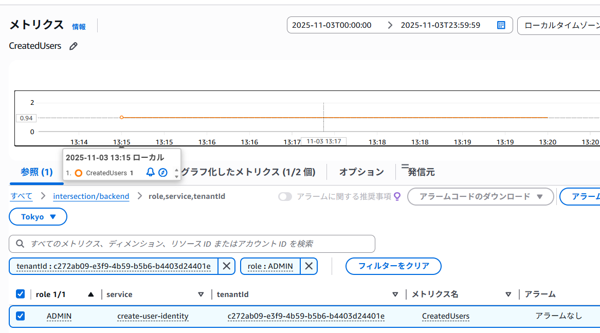
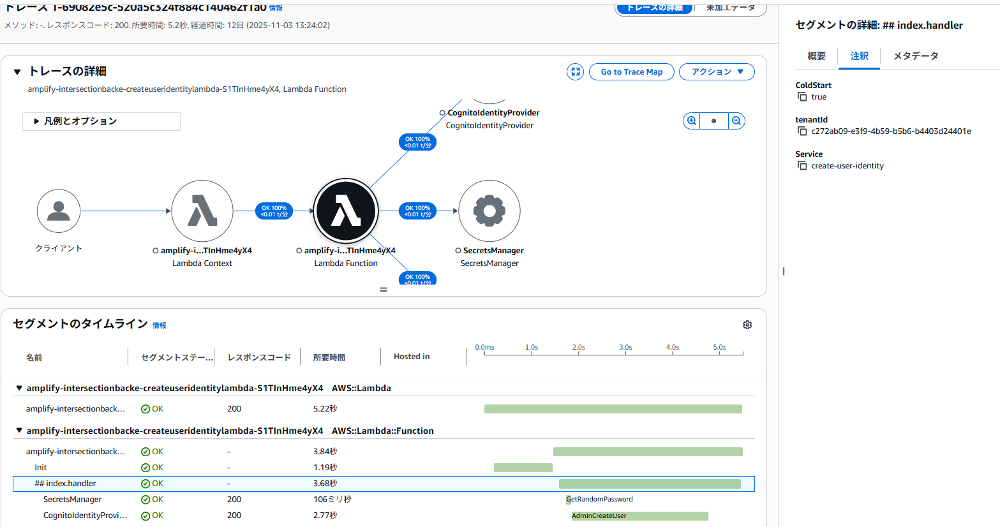
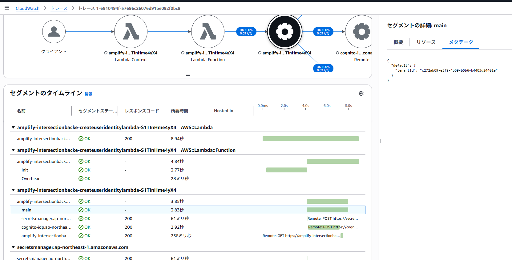

## はじめに

本記事では、「[マルチテナント SaaS アーキテクチャの構築 ― 原則、ベストプラクティス、AWS アーキテクチャパターン](https://www.oreilly.co.jp/books/9784814401017/)の第 7 章「マルチテナントサービスの構築」の内容にて紹介された、テナントコンテキストを考慮した監視ロジックを実際に行っていきます。

具体的には、AWS Amplify Gen2を使用し、AWS Lambdaとしてデプロイされたバックエンドサービス内で、テナントコンテキストを埋め込んだログ、メトリクス、トレースの発行ロジックを実装していきます。

---

## 対象とするバックエンドサービス

ここでは、テナントへのユーザアイデンティティの作成ロジックを対象としていきます。
ロジックは概ね以下の通りです。

- サービスへの入力として、テナント情報(テナントコンテキスト)と、作成するユーザーアイデンティティに関する情報(ユーザ名やメールアドレス等)を受け取る
- 最初にCognitoユーザプールにユーザを作成する
- その後、対応するユーザ情報をDynamoDBのユーザ管理テーブルに作成する(失敗した場合はCognitoユーザープール上のユーザ情報も削除(ロールバック)する)

※コードの全体像は以下を参照

- [apps/backend/lib/domain/service/create-user-identity.ts](https://github.com/horietakehiro/deep-dive-multi-tenant-saas-on-aws/blob/main/apps/backend/lib/domain/service/create-user-identity.ts)
- [apps/backend/amplify/custom/create-user-identity/handler.ts](https://github.com/horietakehiro/deep-dive-multi-tenant-saas-on-aws/blob/main/apps/backend/amplify/custom/create-user-identity/handler.ts)

このバックエンドサービスに、以下の監視ロジックを追加していきます。

- ロギング : テナントIDが含まれたログメッセージを、CloudWatch Logsに出力する
- メトリクス : テナントIDごとのユーザーアイデンティティの作成回数をメトリクスとして、CloudWatchに出力する
- トレース : テナントIDが含まれたトレース情報を、X-Rayに出力する

## 使用ライブラリ

[第7章振返りの記事](https://zenn.dev/horietakehiro/articles/deep-dive-multi-tenant-saas-on-aws-09#%E3%83%86%E3%83%8A%E3%83%B3%E3%83%88%E3%82%B3%E3%83%B3%E3%83%86%E3%82%AD%E3%82%B9%E3%83%88%E3%82%92%E7%94%A8%E3%81%84%E3%81%9F%E3%83%AD%E3%82%B0%E3%81%A8%E3%83%A1%E3%83%88%E3%83%AA%E3%82%AF%E3%82%B9)のサンプルコードのように、前述した監視ロジックをフルスクラッチに近い状態で実装することも出来ますが、ここでは、より効率的な手段として、 **Powertools for AWS Lambda (TypeScript)を使用していきます。**

https://docs.aws.amazon.com/powertools/typescript/latest/

Powertools for AWS Lambdaは、Lambda関数に必要な便利機能を提供し、サーバレスアプリケーションのベストプラクティスに則った実装を支援してくれるライブラリです。

このライブラリの、[Logger](https://docs.aws.amazon.com/powertools/typescript/latest/features/logger/)、[Metrics](https://docs.aws.amazon.com/powertools/typescript/latest/features/metrics/)、[Tracer](https://docs.aws.amazon.com/powertools/typescript/latest/features/tracer/)モジュールを使用していきます。

※加えて、それらのモジュールを使用するためのミドルウェアとして、[Middy](https://middy.js.org/docs)も使用していいきます。

## 実装と結果

### ロギング

Lambda関数で(Middyを使用して)PowertoolsのLoggerモジュールを使用する方法は下記の通り非常にシンプルです。

```js: Loggerの使用例(抜粋)
import middy from "@middy/core";
import { Logger } from "@aws-lambda-powertools/logger";
import { injectLambdaContext } from "@aws-lambda-powertools/logger/middleware";
// サービス名を設定してロガーインスタンスを作成
const logger = new Logger({
  serviceName: "create-user-identity",
  logLevel: "DEBUG",
});
export const handler = middy(
  createUserIdentityFactory({
    // ロガーをサービスに渡す
    // ※他の設定の記載は省略
    logger,
  })
)
  // 併せてLambda関数のコンテキスト情報をログ出力出来るように設定
  .use(injectLambdaContext(logger, { resetKeys: true }));
```

PowertoolsのLoggerモジュールでは、以下のように、ログメッセージに任意のキーバリューのペアを追加することが出来ます。今回はこれを利用して、リクエストに含まれるテナントIDをログに含めます。

```js: テナントコンテキストの埋め込み方
export const createUserIdentityFactory: (
  props: CreateUserIdentityFactoryProps
) => CreateUserIdentity = (props: CreateUserIdentityFactoryProps) => {
  return async ({ arguments: args }) => {
    try {
      // ロガーにテナントIDを埋め込む
      props.logger.appendKeys({ tenantId: args.tenantId });
      props.logger.debug(JSON.stringify(args));

      props.logger.info("最初にCognito上にユーザを作成する");

      // 以下省略

    } finally {
    }
  };
};
```

最終的にCloudWatch Logsに出力されるログには、以下のようにテナントIDが含まれるようになります。

```json
{
  "level": "INFO",
  "message": "最初にCognito上にユーザを作成する",
  "timestamp": "2025-11-03T03:12:55.479Z",
  "service": "create-user-identity",
  "cold_start": true,
  "function_arn": "arn:aws:lambda:ap-northeast-1:382098889955:function:amplify-intersectionbacke-createuseridentitylambda-S1TInHme4yX4",
  "function_memory_size": "512",
  "function_name": "amplify-intersectionbacke-createuseridentitylambda-S1TInHme4yX4",
  "function_request_id": "793876d3-7d8e-4a8b-9395-a8c936d03a56",
  "sampling_rate": 0,
  "xray_trace_id": "1-69081db5-408985cc792e03071134993b",
  "tenantId": "c272ab09-e3f9-4b59-b5b6-b4403d24401e"
}
```

### メトリクス

Metricsモジュールの使用方法もシンプルです。

```js: Metricsの使用例(抜粋)
import { Metrics } from "@aws-lambda-powertools/metrics";
import { logMetrics } from "@aws-lambda-powertools/metrics/middleware";
// サービス名と、メトリクスの名前空間を指定してMetricsインスタンスの作成
const metrics = new Metrics({
  serviceName: "create-user-identity",
  namespace: "intersection/backend",
});
export const handler = middy(
  createUserIdentityFactory({
    // ※他の入力情報は省略
    metrics,
  })
)
  .use(logMetrics(metrics));
```

Metricsモジュールでは以下のように、メトリクスのディメンションとしてテナントIDを埋め込みます。

```js: テナントコンテキストの埋め込み方
export const createUserIdentityFactory: (
  props: CreateUserIdentityFactoryProps
) => CreateUserIdentity = (props: CreateUserIdentityFactoryProps) => {
  return async ({ arguments: args }) => {
    try {
      // CloudWatchメトリクスのディメンションとしてテナントIDを埋め込む
      props.metrics.addDimensions({ tenantId: args.tenantId });
      // 以下省略

      // ユーザーアイデンティティの作成回数をメトリクスとして計上
      props.metrics.addMetric("CreatedUsers", MetricUnit.Count, 1);

    } finally {
    }
  };
};
```

最終的にCloudWatch上で上記のメトリクスは以下のように確認出来ます。



### トレース

Tracerモジュールも前2つと同様に、使い方はシンプルです。

```js: Tracerの使用例(抜粋)
import { Tracer } from "@aws-lambda-powertools/tracer";
import { captureLambdaHandler } from "@aws-lambda-powertools/tracer/middleware";
// サービス名を指定してTracerインスタンスを作成
const tracer = new Tracer({
  serviceName: "create-user-identity",
});
// AWS APIの呼び出しをキャプチャできるようSDKを設定
const cognitoClient = tracer.captureAWSv3Client(
  new CognitoIdentityProviderClient({})
);
export const handler = middy(
  createUserIdentityFactory({
    createCognitoUser: async (args) =>
      await cognitoClient.send(new AdminCreateUserCommand(args)),
    tracer,
  })
)
  .use(captureLambdaHandler(tracer));
```

Tracerモジュールでは以下のように、注釈(アノテーション)情報としてテナントIDをトレースに埋め込みます。

```js: テナントコンテキストの埋め込み方
export const createUserIdentityFactory: (
  props: CreateUserIdentityFactoryProps
) => CreateUserIdentity = (props: CreateUserIdentityFactoryProps) => {
  return async ({ arguments: args }) => {
    try {
      // アノテーションとしてテナントIDをトレースに埋め込む
      props.tracer.putAnnotation("tenantId", args.tenantId);
      // 以下省略

    } finally {
    }
  };
};
```

最終的にX-Rayに記録されるトレースは以下のようになります。



## (おまけ)OpenTelemetryを使用したトレースの収集とテナントコンテキストの埋め込み

ここまではPowertools for AWS Lambdaを使用して、ロギング、メトリクス、トレースにテナントコンテキストを埋め込む実装方法を確認しました。
少し気になったので、最後にOpenTelemetryを使用した、テナントコンテキストを含むトレースの収集方法も少し確認していきます。

ここでは、[AWS Distro for OpenTelemetry (ADOT)](https://aws-otel.github.io/docs/introduction)として提供される、[AWS managed OpenTelemetry Lambda Layers](https://github.com/aws-observability/aws-otel-lambda)を使用してみます。

[ADOTをLambda関数で使用するための手順](https://aws-otel.github.io/docs/getting-started/lambda/lambda-js)は以下の通りです。

- [OpenTelemetry Lambda Layersを使用するよう、Lambda関数を設定](https://github.com/horietakehiro/deep-dive-multi-tenant-saas-on-aws/blob/a81f327d87016a06bb466c40f852be95df7707a2/apps/backend/amplify/backend.ts#L39)

```js Layerの設定を追加
const { cfnFunction } = backend.createUserIdentity.resources.cfnResources;
cfnFunction.tracingConfig = {
  mode: "Active",
};
// AWS managed OpenTelemetry Lambda Layersを使用
cfnFunction.layers = [
  `arn:aws:lambda:ap-northeast-1:901920570463:layer:aws-otel-nodejs-amd64-ver-1-30-2:1`,
];
```

- [自動計装が作動するよう必要な環境変数を追加](https://github.com/horietakehiro/deep-dive-multi-tenant-saas-on-aws/blob/a81f327d87016a06bb466c40f852be95df7707a2/apps/backend/amplify/custom/create-user-identity/resource.ts#L9)

```js: 必要な環境変数を追加
import { defineFunction } from "@aws-amplify/backend";

export const createUserIdentity = defineFunction({
  name: "create-user-identity",
  resourceGroupName: "data",
  timeoutSeconds: 60,
  environment: {
    USER_POOL_ID: "",
    // 自動計装に必要な設定を追加
    AWS_LAMBDA_EXEC_WRAPPER: "/opt/otel-handler",
    OTEL_NODE_ENABLED_INSTRUMENTATIONS: "aws-sdk,aws-lambda,http",
  },
});
```

ここでは以下のように、トレースの属性(メタデータ)としてテナントIDを埋め込みます。

```js: OpenTelemetryのトレーサーの使用例(抜粋)
import { trace } from "@opentelemetry/api";
// トレーサーインスタンスを作成
const tracer = trace.getTracer("create-user-identity");
export const handler = createUserIdentityFactory({
  // ※他の入力項目は省略
  tracer: tracer,
});

```

```js: OpenTelemetryでのテナントコンテキストを埋め込み方
export const createUserIdentityFactory: (
  props: CreateUserIdentityProps
) => CreateUserIdentity = (props: CreateUserIdentityProps) => {
  return async ({ arguments: args }) => {
    // スパンの属性(メタデータとしてテナントIDを設定)
    const span = props.tracer.startSpan("main");
    span.setAttribute("tenantId", args.tenantId);

    // 以下省略

    span.end();
  };
};
```

これによって、トレース情報が自動的にX-Rayに収集され、以下のようにテナントIDを含むトレース情報を確認出来ます。



## 終わりに

AWS Lambdaとしてデプロイされたバックエンドサービス上で、テナントコンテキストを含めた監視情報(ログ、メトリクス、トレース)を実際に収集する方法を確認しました。

Lambda(及びTypeScript又はPython)を使用している場合であれば、Powertools for AWS Lambdaを使用することで、非常にシンプル且つ最小限の労力で監視情報の収集と、それらへのテナントコンテキストの埋め込みを実現することが確認出来ました。
