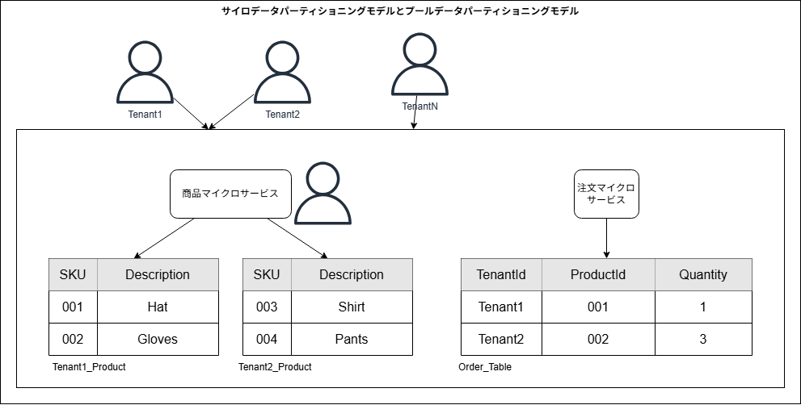
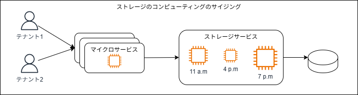
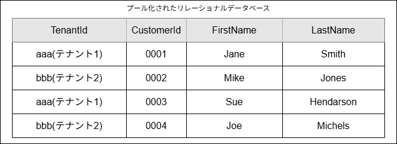
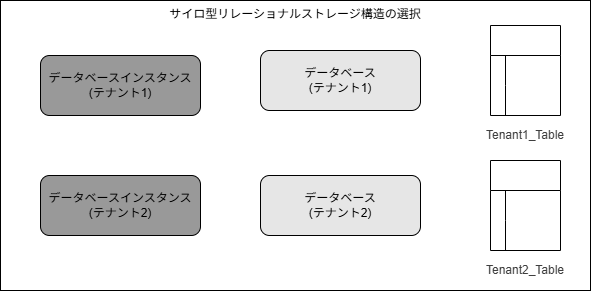
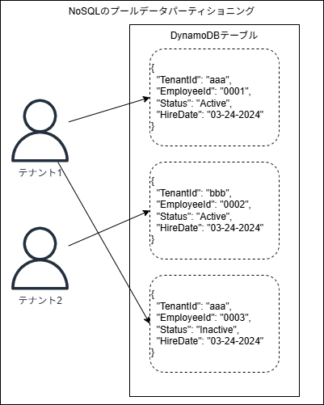
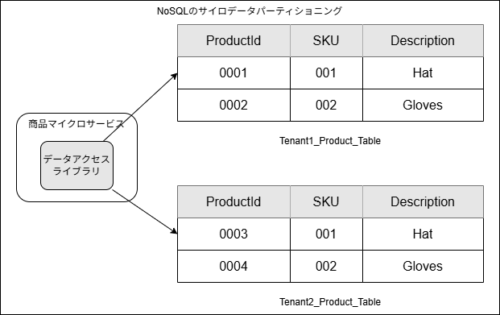

## はじめに

本記事では、「[マルチテナント SaaS アーキテクチャの構築 ― 原則、ベストプラクティス、AWS アーキテクチャパターン](https://www.oreilly.co.jp/books/9784814401017/)の第 8 章「データパーティショニング」の内容を振り返り、自分なりに要点を整理していきます。

8 章では、マルチテナントにおけるストレージ戦略について深掘りしていきます。

---

## データパーティショニングの基礎

データの分割について考えるとき、それは必ずしも各テナントのデータが完全に独立したストレージ構造に格納されていることを意味はしません。これまで登場したように、サイロモデルとプールモデルの概念がここでも登場します。
下図はサイロ化戦略とプール化戦略がマルチテナントのデータパーティショニングの分野にどの様に適用されるかを示す概念図となります。



上図の左側では、商品サービスはテナントごとに個別の、サイロ化されたストレージ構造を利用しており、右側では、注文サービスが全テナント間で共用の、プール化されたストレージ構造を利用しています。
この時テナントとデータの関連付け方もデータパーティショニング方式ごとに異なります。例えば前者では各ストレージ構造(テーブル)の名前にテナント識別子を持たせているのに対して、後者ではTenantIdというようなデータを設けています。
ここで重要なのは、データを保存するためにどんな技術を使用するかに依らず、データの保存方法を決定する際にはサイロとプールのどちらかを意識して考える必要があるという点です。また、サイロとプールのどちらを選択するかによって、拡張性等に関して異なる考慮事項があることにも注意が必要です。

### ワークロード・SLA・そして顧客体験

マルチテナントのストレージ戦略では、拡張性とパフォーマンスを意識することが非常に重要です。
例えば、特定のティアに要求されるストレージのSLAはどの程度でどう満たすことが出来るか、特定のテナントがストレージを飽和させる自体にどう対処出来るか、ストレージリソースを効率的にサイジングさせることは可能か、等々です。
ノイジーネイバー問題はマルチテナントのストレージ戦略を検討するうえで考慮すべき点です。各テナントがシステムのデータをどの様に利用するかを把握し、他のテナントの体験に影響を与えるような不可を発生させるのを防ぐために、パーティショニングやサイロ化、スロットリングの仕組みの導入を検討することが重要になります。

### Blast Radius

あるテナントが別のテナントの体験に影響を与えないよう、ストレージモデルの選択時にBlast Radius - 障害やインシデントから生じる可能性のある損害や影響の範囲 - の考えを戦略の一部に取り入れ、障害の範囲を狭めるために(特に重要な)データをサイロ化する方向に傾くことがあるかも知れません。このアプローチによって、例えばサイロ化された特定データのテナントが何らかの致命的な損失状態に陥った場合でも、その障害の影響を単一のテナントに限定させることが出来ます。
この考えは、デプロイ時にも利点があります。例えば新しいバージョンや機能の配信時に各テナントのサイロ化されたデータが個別に順番に更新されるため、全てのテナントに同時に影響を与えず安全にデプロイを行うことが期待出来ます。
Blast Radiusの問題を抑制するためにサイロモデルを取り入れることには前述のようなメリットがありますが、最終的にはコストや運用特性を踏まえた判断が必要になります。

### 分離の影響

注意すべきなのは、データのパーティショニング戦略とデータのテナント分離とを同一視しないようにすることです。例えば特定のデータ群に対してサイロモデルのデータパーティショニング戦略を採用したとしても、それはデータが分離されたことを必ずしも意味しません。分離とはデータの保存方法を超えた強制力のあるレイヤーを意味します。データがサイロ化されているかプール化されているかに依らず。、データへのアクセス範囲が制限されることがデータの分離を意味しています。
データパーティショニングと分離の関係は、どの様なストレージ技術を選択するかに影響を及ぼします。特定レベルの分離をサポート出来ることを要件としてデータパーティショニング戦略を検討するのであれば、選択するストレージ技術がどの様に必要な分離の要件をサポートしてくれるのかを考慮することが重要になります。

### 管理と運用

データパーティショニング戦略がパフォーマンスと分離面に及ぼす影響だけでなく、SaaS環境の管理と運用面に及ぼす影響も考慮すべきです。例えばサイロモデルとプールモデルが運用チームの体験(デプロイやバックアップ、移行等)にどの様に影響するのかを考える、等です。
一般にプールモデルの方が運用は楽になるのに対して、サイロモデルには複雑さが伴う傾向にあります。
バックアップとリストアについても検討する必要があります。サイロモデルでは比較的簡単に済むかも知れませんが、プールモデルでは、共有ストレージから特定テナントのスナップショットをどの様に取得するかを検討する必要があります。また、リストア時は他のテナントに影響を与えずどの様にリストア出来るかも検討する必要があります。

### 適材適所で使い分けるルール

マルチテナントのストレージ戦略を決定する際に、一つのデータベース技術を全面的に採用することは望ましいアプローチではありません。何故ならストレージ技術の選択に影響を及ぼす変数は非常に多く、システムの各部分でその内容も異なる可能性があるためです。そのため、サービスごとにストレージ技術の選択肢を評価することが重要です。

### プールモデルのデフォルト化

サイロとプールのどちらを選択すべきかどうしても特定出来ない場合は、デフォルトとしてプールモデルを選択することが一般には推奨されます。プールモデルのコスト、運用、俊敏性の利点が大きいためです。

## ライトサイジングの課題

この書籍で目指しているのは、インフラストラクチャの利用状況をテナントのアクティビティと一致させるという考え方です。これはSaaSビジネスの基本である、コスト効率性の追及の一環でもあります。
マルチテナント環境では、ストレージのコンピューティングのサイジングがこの点における課題となります。
サービスのコンピューティングリソースは運用の過程で水平方向にスケーリング出来るのが一般的である一方、ストレージは下図のように、環境の初期段階で特定のソリューションを選択したあとは、それっきりになることが多いです。
※下図では1日の間にコンピューティングの必要量が1日を通して変動することを表現



この課題の難易度はサイロモデルとプールモデルとで多少異なります。プールモデルでは、ストレージサービスのコンピューティングサイズを適切に設定するのは非常に困難です。テナントごとのワークロードの変化や突発的な負荷に対応するためには一般的にはコンピューティングを常時過剰にプロビジョニングしておくことになりますが、結果としてコストの効率性に悪影響をもたらします。
一方でサイロモデルあれば考慮すべき変数が少ないためサイジングは幾らか楽になります。ただしこの場合も、幾らかのコストやリソースの非効率性は避けられません。

### スループットとスロットリング

ライトサイジングの課題に対処する方法の一つは、ストレージのスループットとスロットリング戦略を導入することです。この仕組みによって、テナントのティアやペルソナに基づいて個別の体験をサポートし、ストレージリソースの利用状況をより適切に管理可能なポリシーを導入出来ます。

### サーバレスストレージ

ライトサイジングの課題は、コンピューティングの処理能力を事前に決定する必要があるストレージ技術が前提となっています。一方で、特定のコンピューティング特性に縛られないサーバレスモデルを採用するストレージ技術も増えつつあります。
サーバレスストレージでは、その都度のアクティビティのの状況に基づいてコンピューティングのサイズが決定されます。コンピューティングはシステムの負荷に応じて自動的にサイジングされるため、マルチテナント環境の要件に適していると言えます。
AWSにおける具体的なサーバレスストレージの例としては、Amazon Aurora ServerlessやAmazon Dynamo DBが該当します。

## リレーショナルデータベールのパーティショニング

ここまでのデータパーティショニングの概念がリレーショナルデータベースにどの様に活用されるかを見ていきます。
リレーショナルデータベースでデータの分割を行う方法は様々ありますが、一貫しているのはそれらがいずれもスキーマに依存しているという点です。この点は特定のスキーマ表現から別のスキーマ表現にテナントを柔軟に以降させる必要なあるようなマルチテナント環境では課題となる可能性があります。リレーショナルデータベースをストレージ戦略として選択する際にはこの点が俊敏性や運用にもたらす影響を考慮する必要があります。

### リレーショナルデータベースのプールデータパーティショニング

リレーショナルデータベースでプールモデルのデータを保存する仕組みはシンプルです。具体的には下図のように、既存のデータベース設計にテナント識別子を導入して、テーブル内のアイテムを特定のテナント識別子と対応づけるようにするだけです。



テナント識別子を追加することで、テナント分離の対象となるポリシーを適用することが可能になります。例えばテーブルのビューをテナント識別子でフィルタリングし、テナント間のデータアクセスを防止するといった具合です。

### リレーショナルデータベースのサイロデータパーティショニング

リレーショナルデータベースでデータをサイロ化するときに使用可能な構造は下図のように複数考えられます。



上図の左側は、テナントごとにデータベースのインスタンスを用意するモデルを示します。これはテナントごとに全く別のインフラストラクチャを用意することを意味します。
真ん中はテナントごとに専用のデータベースが単一のデータベースインスタンス内で稼働しています。各データベースは完全に独立していますが、親のデータベースインスタンスの基盤となるコンピューティングは全て共有されます。
右側は、各テナントのデータを個別のテーブルとしてサイロ化しています。これらのテーブルは全て単一のデータベース及びデータベースインスタンス内にデプロイされます。

これらのいずれのモデルでも、リソースに名前やタグを割り当て、プログラムの実行時にはテナントからのリクエストを適切な宛先にルーティング出来る必要があります。
また、要件に合わせて必要な拡張が可能かを検討する必要があります。例えばRDSでは単一のデータベースインスタンス内に作成可能なデータベース数やテーブル数には上限があります。

サイロ化を選択する理由には、ドメインのセキュリティコンプライアンス上の必要性から来る可能性もあります。ただし場合によっては、ストレージをサイロ化するだけでは求められるテナントの分離は完全に実現出来ない可能性もあります。重要なのは、どのサイロ化構造を選択するかは、分離ポリシーによってテナント間のアクセスを防止できるかどうかによっても影響を受けるという点です。

## NoSQLのデータパーティショニング

ここではNoSQLストレージの中でも具体的にAmazon DynamoDBに焦点を当てて、データパーティショニング戦略を見ていきます。
NoSQLのスキーマレスな特性は、マルチテナントSaaSアプリケーションに大きなメリットをもたらします。大規模なプール環境を運用し、新しいデータ構造を含む変更をデプロイする必要が発生した場合、リレーショナルデータベースであれば一連の複雑な更新・移行作業が発生するのに対して、NoSQLでははるかに簡単に済むことが予想されます。また、DynamoDBにはインスタンスやデータベースという概念は存在しないため、データの分割に使用出来るストレージ構造は自ずと限定されます。

### NoSQLのプールデータパーティショニング

NoSQLにおけるデータのプール化は基本的にはリレーショナルデータベースと似ています。
DynamoDBでは下図のように全てのデータはテーブルに格納され、各データにはテナント情報が含まれます。



### NoSQLのサイロデータパーティショニング

DynamoDBにおける唯一のサイロ化戦略は、下図のようにテナントごとに専用のテーブルを作成することです。



上図では、テーブルとテナントを関連付けるためにテーブル名にテナント識別子を追加しています。そしてサービスの実行時に、受信した各リクエストをテーブルに適切にルーティングしてあげるイメージです。

### NoSQLのチューニング方法

DynamoDBのデータパーティショニングの方法は通常簡単ですが、マルチテナントデータを保存するうえで考慮すべきことは様々あります。
例えばテーブルごとのキャパシティーモードです。オンデマンドモードであれば、負荷状況が予測しにくいマルチテナントのワークロードに対しては有効だと言えます。一方でプロビジョニングモードは、負荷状況がより明確なサイロ化されたテーブルや、システムのボトルネックとなっていて安定稼働が求められるテーブルに適用することが良い結果をもたらす可能性があります。

```json
{
  "TenantId": "0001",
  "ProductId": "001",
  "Desccription": "Men's shirt",
  "Category": "Shirt."
}
```
