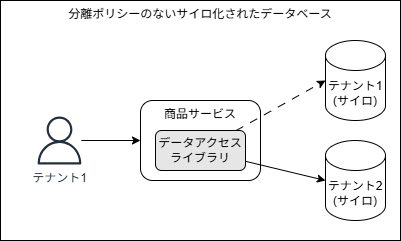
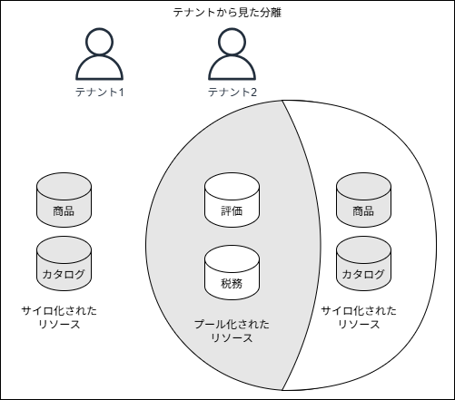
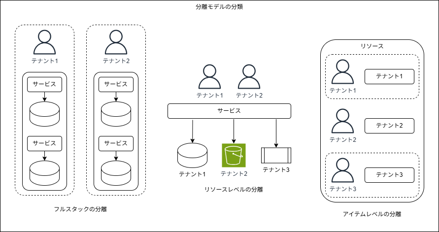

## はじめに

本記事では、「[マルチテナント SaaS アーキテクチャの構築 ― 原則、ベストプラクティス、AWS アーキテクチャパターン](https://www.oreilly.co.jp/books/9784814401017/)の第 9 章「テナント分離」の内容を振り返り、自分なりに要点を整理していきます。

9 章では、マルチテナントにおけるテナント分離について深掘りしていきます。

---

## 中心的な概念

テナント分離における重要な概念は、リソースのデプロイ方法や単位と、テナント分離とは明確に分けて考えるべきだという点です。下図はその点を表す概念図です。

上図には各テナントの商品データをサイロ化した商品サービスがあります。一見すると、テナントデータを個別のデータベースに保存するだけで、他のテナントのデータへのアクセスを制限するというテナント分離を実現していると考えられるかも知れませんが、これでは不十分です。
例えばテナントコンテキストに基づいてデータベースへのリクエストをルーティングするサービス内のコード内で、テナント1がテナント2に置き換えられた状況を想像すると、テナント1からのリクエストがテナント2にルーティングされてしまいます。
つまり、単にデータベースを分離しただけでは、テナント分離を保障していることにはなりません。

そこで、リソースのデプロイ方法に関係なくテナント分離を強制する、下図のような仕組みを、コードとコードによってアクセスされるリソースの間に別途導入する必要があります。

上図の例では、商品サービスのコードがデータにアクセスしようとするたびに、分離ポリシーのレイヤがそのリクエストをテナントコンテキストに基づいて評価します。これによって、テナント分離を保障することが出来るようになります。
重要なのは、マルチテナント環境では、デプロイモデルや技術に関わらず、テナントリソースを分離する仕組みが必要だということです。下図はそのことを表現しています。

上図にはサイロ化されたリソースとプール化されたリソースを組み合わせて使用している2つのテナントがあります。このソリューション内部では、分離ポリシーによって各テナントのリソースを確実に保護する責任をアプリケーションの実装が担っています。ここで重要なのは、テナントから見れば、たとえプール化されたインフラストラクチャ上で稼働していても、どのリソースも他テナントと共有されていないという点です。

### 分離モデルの分類

ここでは、SaaS環境に実装できる様々な分離の概念を定義していきます。下図は3つの主要な分離パターンです。

上図は左からより粗い粒度の分類から恥あり、右に行くほど狭くなっていきます。
一番左のフルスタックの分離では、各テナントにリソースの専用スタックが与えられる、フルスタックのデプロイモデルを活用するマルチテナント環境と対応しています。この時のリソース分離の仕組みは一般的にシンプルになります。
真ん中のリソースレベルの分離では、複数のテナントのリソースを利用する共用サービスのレイヤがあり、各テナント用のリソースが分離の単位となっています。
一番右のアイテムレベルの分離では、例えば複数のテナントのデータが混在するプール型のデータベース内でテナント分離を実現するイメージです。リソース内で利用可能な分離の仕組みは少なく、一般的にこの仕組みは最も難しくなります。

マルチテナントアーキテクチャを設計する場合には、これらの3種類のテナント分離のいずれかを検討することになります。

### アプリケーションによる強制的な分離

例えばAWSであれば、IAMの仕組みによってテナント分離を実現出来るのが自然だと考えられます。しかしアーキテクチャやユースケースによっては、必要なレベルの分離制御をそれらがサポートしておらず、アプリケーションに独自に実装する必要がある場合があります。
その場合、属性ベースのアクセス制御(ABAC)やオープンポリシーエージェント(OPA)の仕組みを踏まえ、適切なツールを選択する必要があります。

### RBAC、認可、分離

役割ベースのアクセス制御(RBAC)と認可の構造を利用して、アプリケーション内の機能っへのアクセス範囲を制御することが出来ますが、アプリケーションのアクセス制御とテナント分離の境界線を曖昧化することがあります。
例えば、テナントがテナント管理者の役割でSaaSアプリケーションに認証されるとします。この時、アプリケーション内ではRBACフレームワークを使用して、特定のアプリケーション機能へのアクセスを有効化/無効化しているとします。
RBACは通常、環境内における個々のユーザの役割に基づいてアクセスを制御します。一方でテナント分離は、個々のユーザの役割とは関係なく、ユーザのテナントコンテキストのみに基づきます。つまり、テナント分離は全てのユーザに対して同じ制御が適用される必要があり、この両者の違いを区別しておくことが重要です。

## 分離モデルのレイヤー

分離の概念を整理したところで、より具体的な分離の構造に目を向けます。下図は、マルチテナントアーキテクチャの様々なレイヤーが分離の構造にどう当てはまるかの概念図です。

一番上にっくるのは、分離する必要があるアプリケーションサービスの入口です。このゲートウェイを介して送信される各リクエストには、システムがテナント分離を適用するために必要なテナントコンテキストが含まれます。ここでリクエストごとのテナントコンテキストを抽出し、テナントごとに有効なルートを判断します。これによって、テナントが特定のテナントコンテキストにとって有効ではない宛先にリクエストをすることを防止出来ます。
コンピューティングレイヤでは、マイクロサービスが他の依存リソース(DBやファイルシステム等)にアクセスする際に、各マイクロサービスがそのテナント専用のリソースにしかアクセス出来ないことを確実にするために次のレベルの分離が適用されます。サイロ化されたリソースであれば比較的簡単かも知れませんが、例えばプール化されたリソースへのアクセスを制御するためには、アイテムレベルの分離を実装する必要があるかも知れません。

これらのレイヤ型モデルによって、マルチテナントアーキテクチャの複数の側面に渡って分離がどの様に適用されるかを深く考えることが出来ます。

## デプロイ時とランタイムでの分離
