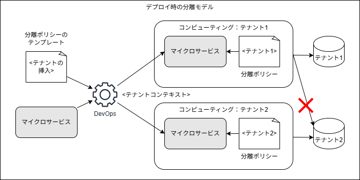
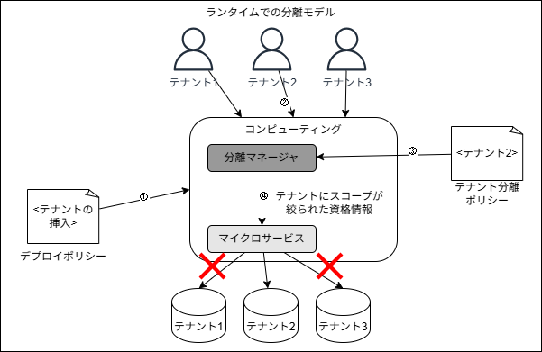
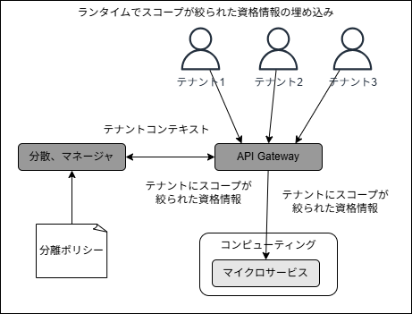
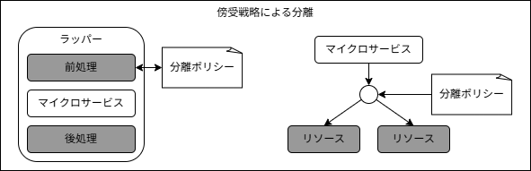
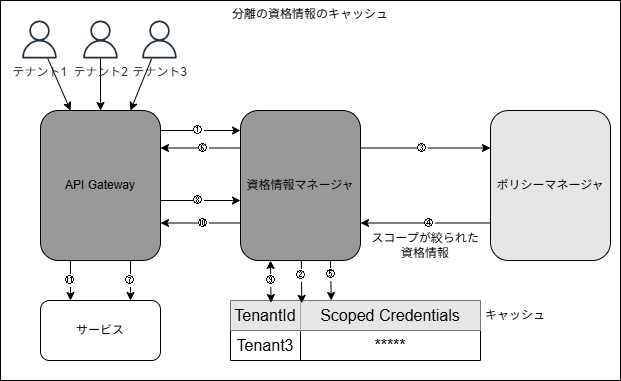
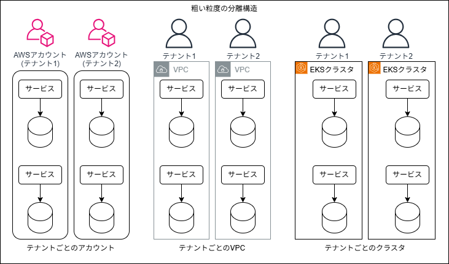
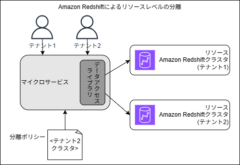
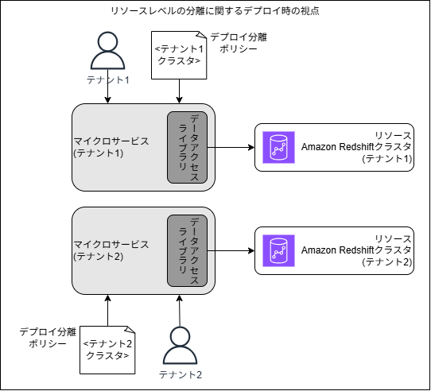
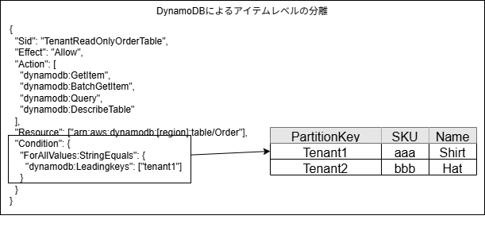
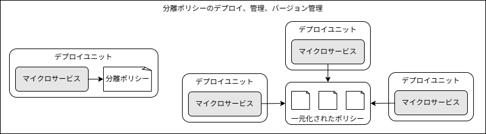

## はじめに

本記事では、「[マルチテナント SaaS アーキテクチャの構築 ― 原則、ベストプラクティス、AWS アーキテクチャパターン](https://www.oreilly.co.jp/books/9784814401017/)の第 9 章「テナント分離」の内容を振り返り、自分なりに要点を整理していきます。

9 章では、マルチテナントにおけるテナント分離について深掘りしていきます。

---

## 中心的な概念

テナント分離における重要な概念は、リソースのデプロイ方法や単位と、テナント分離とは明確に分けて考えるべきだという点です。下図はその点を表す概念図です。

上図には各テナントの商品データをサイロ化した商品サービスがあります。一見すると、テナントデータを個別のデータベースに保存するだけで、他のテナントのデータへのアクセスを制限するというテナント分離を実現していると考えられるかも知れませんが、これでは不十分です。
例えばテナントコンテキストに基づいてデータベースへのリクエストをルーティングするサービス内のコード内で、テナント1がテナント2に置き換えられた状況を想像すると、テナント1からのリクエストがテナント2にルーティングされてしまいます。
つまり、単にデータベースを分離しただけでは、テナント分離を保障していることにはなりません。

そこで、リソースのデプロイ方法に関係なくテナント分離を強制する、下図のような仕組みを、コードとコードによってアクセスされるリソースの間に別途導入する必要があります。

上図の例では、商品サービスのコードがデータにアクセスしようとするたびに、分離ポリシーのレイヤがそのリクエストをテナントコンテキストに基づいて評価します。これによって、テナント分離を保障することが出来るようになります。
重要なのは、マルチテナント環境では、デプロイモデルや技術に関わらず、テナントリソースを分離する仕組みが必要だということです。下図はそのことを表現しています。

上図にはサイロ化されたリソースとプール化されたリソースを組み合わせて使用している2つのテナントがあります。このソリューション内部では、分離ポリシーによって各テナントのリソースを確実に保護する責任をアプリケーションの実装が担っています。ここで重要なのは、テナントから見れば、たとえプール化されたインフラストラクチャ上で稼働していても、どのリソースも他テナントと共有されていないという点です。

### 分離モデルの分類

ここでは、SaaS環境に実装できる様々な分離の概念を定義していきます。下図は3つの主要な分離パターンです。

上図は左からより粗い粒度の分類から恥あり、右に行くほど狭くなっていきます。
一番左のフルスタックの分離では、各テナントにリソースの専用スタックが与えられる、フルスタックのデプロイモデルを活用するマルチテナント環境と対応しています。この時のリソース分離の仕組みは一般的にシンプルになります。
真ん中のリソースレベルの分離では、複数のテナントのリソースを利用する共用サービスのレイヤがあり、各テナント用のリソースが分離の単位となっています。
一番右のアイテムレベルの分離では、例えば複数のテナントのデータが混在するプール型のデータベース内でテナント分離を実現するイメージです。リソース内で利用可能な分離の仕組みは少なく、一般的にこの仕組みは最も難しくなります。

マルチテナントアーキテクチャを設計する場合には、これらの3種類のテナント分離のいずれかを検討することになります。

### アプリケーションによる強制的な分離

例えばAWSであれば、IAMの仕組みによってテナント分離を実現出来るのが自然だと考えられます。しかしアーキテクチャやユースケースによっては、必要なレベルの分離制御をそれらがサポートしておらず、アプリケーションに独自に実装する必要がある場合があります。
その場合、属性ベースのアクセス制御(ABAC)やオープンポリシーエージェント(OPA)の仕組みを踏まえ、適切なツールを選択する必要があります。

### RBAC、認可、分離

役割ベースのアクセス制御(RBAC)と認可の構造を利用して、アプリケーション内の機能っへのアクセス範囲を制御することが出来ますが、アプリケーションのアクセス制御とテナント分離の境界線を曖昧化することがあります。
例えば、テナントがテナント管理者の役割でSaaSアプリケーションに認証されるとします。この時、アプリケーション内ではRBACフレームワークを使用して、特定のアプリケーション機能へのアクセスを有効化/無効化しているとします。
RBACは通常、環境内における個々のユーザの役割に基づいてアクセスを制御します。一方でテナント分離は、個々のユーザの役割とは関係なく、ユーザのテナントコンテキストのみに基づきます。つまり、テナント分離は全てのユーザに対して同じ制御が適用される必要があり、この両者の違いを区別しておくことが重要です。

## 分離モデルのレイヤー

分離の概念を整理したところで、より具体的な分離の構造に目を向けます。下図は、マルチテナントアーキテクチャの様々なレイヤーが分離の構造にどう当てはまるかの概念図です。

一番上にっくるのは、分離する必要があるアプリケーションサービスの入口です。このゲートウェイを介して送信される各リクエストには、システムがテナント分離を適用するために必要なテナントコンテキストが含まれます。ここでリクエストごとのテナントコンテキストを抽出し、テナントごとに有効なルートを判断します。これによって、テナントが特定のテナントコンテキストにとって有効ではない宛先にリクエストをすることを防止出来ます。
コンピューティングレイヤでは、マイクロサービスが他の依存リソース(DBやファイルシステム等)にアクセスする際に、各マイクロサービスがそのテナント専用のリソースにしかアクセス出来ないことを確実にするために次のレベルの分離が適用されます。サイロ化されたリソースであれば比較的簡単かも知れませんが、例えばプール化されたリソースへのアクセスを制御するためには、アイテムレベルの分離を実装する必要があるかも知れません。

これらのレイヤ型モデルによって、マルチテナントアーキテクチャの複数の側面に渡って分離がどの様に適用されるかを深く考えることが出来ます。

## デプロイ時とランタイムでの分離

分離モデルを前述のようにレイヤー化することに加えて、分離をいつ適用するかも考慮する必要があります。環境によって、リソースのデプロイ時に分離ポリシーを適用できるものもあれば、ランタイムに適用できるものもあります。
ここでは、その両者の違いについて見ていきます。

まずはデプロイ時の分離について見ていきます。上図は2つのテナントに対してサイロモデルでデプロイされたマイクロサービスを表しています。このサイロモデルの構成ではデプロイされたサービスが稼働している間、特定のテナントに割り当てられ、他のテナント用のリソースにアックセス出来ないようにする、スコープが絞られたポリシーを適用されています。
図の左側には、マイクロサービスと、マイクロサービスのアクセス範囲を設定するために使用されるテンプレート化された分離ポリシーがあります。そしてDevOpsツールによるマイクロサービスのコンピューティングリソースのデプロイ時に、分離ポリシーのテンプレートにテナントコンテキストが挿入されます。
デプロイ時の分離ポリシーの利点は、ポリシーをサービスのコードから独立させられるため、開発者は分離戦略を意識せずサービスを実装することが出来ます。一方で問題は、サイロモデルのアーキテクテャでしか使用出来ないという点です。

次にランタイムの分離について見ていきます。ランタイムの分離は下図のように、アプリケーションコード内で分離ポリシーを動的に取得し適用する戦略が用いられます。

上図のプール化されたマイクロサービスのコンピューティングは全てのテナントのリクエストを適切に処理する必要があります。そのためまずは、全てのテナントに対応するスコープのポリシーでデプロイされている必要があります(①)。テナントから実際にリクエストを受け取ると(②)、マイクロサービスのコンピューティング内の分離マネージャーでテナントコンテキストを用いてポリシーを生成し、特定のテナントにスコープが絞られた資格情報を取得します(③④)。その資格情報に基づいて、マイクロサービスは適切なテナントのリソースにのみアクセスすることが出来ます(⑤)。
このアプローチはアプリケーションのコードとライブラリに大きく依存していると言えます。その分テナント分離の実装を開発者が回避する余地が残されているといえる一方、前述の分離マネージャーをサイドカーにする方式や、後述の傍受方式等を採用することで、開発者の目の届かない方式で実装することでこの分離ポリシーを強制しやすくなります。
下図は、分離マネージャをマイクロサービスの外部に移行させる代替戦略の概念図になります。

上図ではマイクロサービスの前段にAPI Gatewayが配置され、分離マネージャと連携してテナントコンテキストからスコープが絞られた資格情報を取得し、それを下流のマイクロサービスに渡しています。

### 傍受による分離

ランタイム分離に関して目指すべき点は、開発者を分離の実装から出来るだけ引き離すことです。そこで、下図の様な傍受による仕組みを用いて、開発者の意識しない場所で分離を強制させる方式が有効になり得ます。

左側は、より言語又はフレームワークベースのアプローチです。このアプローチではアスペクト、ミドルウェア、ラッパーライブラリ等を使用してアプリケーションコードの前後に分離のロジックが挿入されます。
右側は、リソースとマイクロサービスの間にプロキシの様な傍受の仕組みをサイドカー方式で配置するアプローチです。

### 拡張性の考慮事項

ランタイムの分離は環境の拡張性の問題を引き起こす可能性があります。例えば、大量のリクエストを処理する必要があるプール化されたサービスが存在している場合、それに対して各リクエストごとにスコープが絞られた資格情報をを生成する分離マネージャが、レイテンシーのボトルネックになる可能性があります。
このような問題に対処するために、下図の様なキャッシュ戦略を採用することが検討できます。

API Gatewayを介してSaaSアプリケーションのサービスにアクセスする複数のテナントがあるとします。例えばテナント3がリクエストを行うとゲートウェイは資格情報マネージャを呼び出し、スコープが絞られた資格情報を取得します(①)。この時資格情報マネージャはまず、キャッシュに該当する資格情報が存在しないかを確認し(②)、存在しなければポリシーマネージャから新規に資格情報を生成します(③④)。その後、資格情報はキャッシュに保存された後に(⑤)ゲートウェイに渡され、下流のサービスで使用されます(⑦)。次にテナント3からリクエストを受け取った際にはキャッシュに保管された資格情報を返すことで、レイテンシーを改善することが可能です(⑧⑨⑩⑪)。

## 実装

ここまで分離戦略の設計に関する原則を見てきました。ここからは、分離戦略の具体的な実装例について見ていきます。

### フルスタックの分離

まずは下図のような、AWSにおけるフルスタックのサイロモデルを実装するための粗い粒度の分離の構成を見ていきます。

基本的に上図の構成はいずれも、テナントごとに完全に専用のリソースが提供され、リソース間の境界線を設定するために使用されるツールや技術と、分離の境界線は自然と合致します。

### リソースレベルの分離

ここでは下図の様にAmazon Redshiftを例にリソースレベルの分離の実装例を見てい行きます。

上図はRedshiftをサイロモデルで使用し、各テナントに独自のRedshiftクラスタのリソースが割り当てられています。
ここではランタイムの分離戦略を用いてスコープが絞られた資格情報を取得し、データアクセスライブラリから特定のテナント用のクラスタにアクセスする方式となっています。

対象的にデプロイ時の分離戦略を用いた場合は下図のようになります。

このような構成が可能であれば、データアクセスライブラリに余分な負荷や複雑さを埋め込まず、デプロイ時にコンピューティングに適用されたポリシーによって分離を実現することが出来ます。

### アイテムレベルの分離

ここでは下図の様にDynamoDBを例に、AWSでのアイテムレベルの分離の実現方式を見ていきます。

上図の右側のように、複数テナントのアイテムが保管されたDynamoDBテーブルがあるとします。このテーブルに対してアイテムレベルの分離を実現するには、例えば左側の様なIAMポリシーを用意することで、テナント1にスコープが絞られたアクセスを実現することが出来ます。

## 分離ポリシーの管理

分離ポリシーのライフサイクルの管理についても考える必要があります。ポリシーはどこで、誰が管理し、いつどの様にデプロイされるのか、等です。下図は分離ポリシーを管理する2つのアプローチを表しています。

左側のモデルは、個々のマイクロサービスを中心としたアプローチです。分離ポリシーはマイクロサービスの拡張機能として捉えられ、ソリューションの実装と深く関連させます。
右側のモデルは、全ての分離ポリシーを一元的な仕組みの下で管理するアプローチです。ポリシーのメンテナンスは各開発チームが担いますが、ポリシーはマイクロサービスの外で管理・デプロイされ、各マイクロサービスから参照される関係となります。

分離ポリシーはまた、実際に機能していることをテストすることも考慮する必要がある一方、テストは分離ポリシーにおける困難な側面の一つにもなります。
無効なテナントコンテキストを渡して分離ポリシーが機能しているかを確認出来るようにするために、コード内に特別なパスや機能フラグを埋め込んだり、カオスエンジニアリング戦略を活用したりする等も検討する必要があります。

## 終わりに

テナント分離は、全てのマルチテナント環境において取り組む必要がある基本的なトピックの一つです。その実現のために、ここで紹介した様々な方式の分離戦略が役立ちます。
